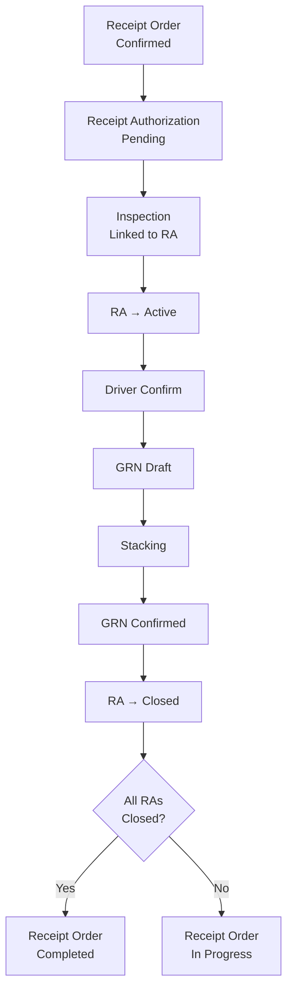

# Design Document: Receipt Authorization

## Overview

Receipt Authorization (RA) is a new per-truck authorization layer that sits between a confirmed Receipt Order and the physical receipt of goods at a store. Each truck delivering against a Receipt Order must have a corresponding RA before the Storekeeper can record an Inspection, confirm driver delivery, or generate a GRN.

The feature introduces:
- A **Receipt Authorizer** role assignable per hub or warehouse
- A new `ReceiptAuthorization` model with a Pending → Active → Closed lifecycle
- A **Driver Confirm** step that gates GRN creation
- A revised **GRN lifecycle**: Draft (after Driver Confirm) → Confirmed (after finish_stacking)
- **Receipt Order completion logic** driven by RA closure rather than a single finish_stacking call

The existing Receipt Order flow (Steps 1–4) and stacking flow (Steps 10–11) are preserved and extended, not replaced.

---

## Architecture

The feature follows the existing Rails engine architecture under `Cats::Warehouse`. All new code lives in `backend/warehouse-backend/engines/cats_warehouse/`.



### Layer Responsibilities

| Layer | Responsibility |
|---|---|
| **Model** | `ReceiptAuthorization` — data, validations, associations, status transitions |
| **Service** | `ReceiptAuthorizationService` — creation, cancellation, quantity validation |
| **Service** | `DriverConfirmService` — records confirmation, triggers GRN creation |
| **Service** | `ReceiptOrderCompletionChecker` — evaluates whether all RAs are Closed |
| **Controller** | `ReceiptAuthorizationsController` — REST endpoints, Pundit authorization |
| **Policy** | `ReceiptAuthorizationPolicy` — role-based access control |
| **Serializer** | `ReceiptAuthorizationSerializer` — JSON representation |
| **Migration** | New table + FK columns on existing tables |
| **Frontend** | New pages and API client for Hub Manager and Storekeeper flows |

---

## Components and Interfaces

### Backend Components

#### New: `ReceiptAuthorization` Model

```ruby
# cats_warehouse_receipt_authorizations
# receipt_order_id        :bigint  NOT NULL
# receipt_order_assignment_id :bigint  (nullable for standalone warehouse orders)
# store_id                :bigint  NOT NULL
# warehouse_id            :bigint  NOT NULL  (denormalized for scoping queries)
# authorized_quantity     :decimal(15,3) NOT NULL
# driver_name             :string  NOT NULL
# driver_id_number        :string  NOT NULL
# truck_plate_number      :string  NOT NULL
# transporter_id          :bigint  NOT NULL
# waybill_number          :string  NOT NULL
# reference_no            :string  UNIQUE
# status                  :string  NOT NULL  default: "pending"
# driver_confirmed_at     :datetime
# driver_confirmed_by_id  :bigint
# created_by_id           :bigint  NOT NULL
# cancelled_at            :datetime
# cancelled_by_id         :bigint
```

Associations:
- `belongs_to :receipt_order`
- `belongs_to :receipt_order_assignment, optional: true`
- `belongs_to :store`
- `belongs_to :warehouse`
- `belongs_to :transporter` (via `Cats::Core::Transporter`)
- `belongs_to :created_by, class_name: "Cats::Core::User"`
- `belongs_to :driver_confirmed_by, class_name: "Cats::Core::User", optional: true`
- `has_one :inspection` (the linked Inspection)
- `has_one :grn` (the auto-generated GRN)

Status constants: `PENDING = "pending"`, `ACTIVE = "active"`, `CLOSED = "closed"`, `CANCELLED = "cancelled"`

#### New: `ReceiptAuthorizationService`

Handles RA creation and cancellation:

```ruby
ReceiptAuthorizationService.new(
  receipt_order: order,
  actor: current_user,
  store: store,
  authorized_quantity: qty,
  driver_name: ...,
  driver_id_number: ...,
  truck_plate_number: ...,
  transporter: transporter,
  waybill_number: ...
).call
# => ReceiptAuthorization (Pending)
```

Responsibilities:
- Validates store belongs to an allocated warehouse
- Validates sum of RA quantities ≤ assignment allocation
- Generates unique `reference_no` (format: `RA-{SecureRandom.hex(4).upcase}`)
- Sets status to `pending`
- Sends notification to Storekeeper
- Records `WorkflowEvent`

#### New: `DriverConfirmService`

```ruby
DriverConfirmService.new(
  receipt_authorization: ra,
  actor: current_user
).call
# => ReceiptAuthorization (with driver_confirmed_at set, GRN created in Draft)
```

Responsibilities:
- Records `driver_confirmed_at` and `driver_confirmed_by`
- Creates GRN in `draft` status linked to the RA and its Inspection
- Sends notification to Hub Manager / Warehouse Manager
- Records `WorkflowEvent`

#### New: `ReceiptOrderCompletionChecker`

```ruby
ReceiptOrderCompletionChecker.new(receipt_order: order, actor: actor).call
```

Called after every RA transitions to `closed` or `cancelled`. Checks whether all non-cancelled RAs for the order are `closed`. If so, transitions the Receipt Order to `completed` and sends notification to the creating Officer.

#### Modified: `InspectionCreator`

Adds `receipt_authorization_id` parameter. When provided:
- Links the Inspection to the RA
- Transitions RA from `pending` → `active`
- Validates only one active Inspection per RA

#### Modified: `ReceiptOrdersController#finish_stacking`

The existing `finish_stacking` action is modified to:
- Accept a `receipt_authorization_id` parameter
- Confirm the linked GRN (transition Draft → Confirmed)
- Transition the RA from `active` → `closed`
- Call `ReceiptOrderCompletionChecker` instead of directly marking the order `completed`

#### Modified: `UserAssignment` Model

Adds `"Receipt Authorizer"` to the `role_name` inclusion validation. Assignment target rules:
- Receipt Authorizer must be scoped to a hub or warehouse (not a store)

#### Modified: `AccessContext`

Adds:
```ruby
def receipt_authorizer?
  user&.has_role?("Receipt Authorizer")
end

def assigned_receipt_authorizer_hub_ids
  UserAssignment.where(user_id: user&.id, role_name: "Receipt Authorizer").pluck(:hub_id).compact
end

def assigned_receipt_authorizer_warehouse_ids
  UserAssignment.where(user_id: user&.id, role_name: "Receipt Authorizer").pluck(:warehouse_id).compact
end

def can_create_receipt_authorization_for_warehouse?(warehouse_id)
  return true if admin?
  return true if hub_manager? && Warehouse.where(hub_id: assigned_hub_ids).exists?(id: warehouse_id)
  return true if warehouse_manager? && assigned_warehouse_ids.include?(warehouse_id)
  return true if receipt_authorizer? && (
    assigned_receipt_authorizer_warehouse_ids.include?(warehouse_id) ||
    Warehouse.where(hub_id: assigned_receipt_authorizer_hub_ids).exists?(id: warehouse_id)
  )
  false
end
```

#### New: `ReceiptAuthorizationsController`

REST resource under `/v1/receipt_authorizations`:

| Method | Path | Action |
|---|---|---|
| GET | `/receipt_authorizations` | `index` — list RAs (scoped by role) |
| GET | `/receipt_authorizations/:id` | `show` |
| POST | `/receipt_authorizations` | `create` |
| PATCH | `/receipt_authorizations/:id` | `update` (Pending only) |
| POST | `/receipt_authorizations/:id/cancel` | `cancel` |
| POST | `/receipt_authorizations/:id/driver_confirm` | `driver_confirm` |

#### New: `ReceiptAuthorizationPolicy`

```ruby
def create?
  admin? || hub_manager? || warehouse_manager? || receipt_authorizer?
  # Further scoped by warehouse in the service layer
end

def update?
  create? && record.status == "pending"
end

def cancel?
  create? && record.status == "pending" && record.inspection.nil?
end

def driver_confirm?
  storekeeper? || admin?
end
```

#### New: `ReceiptAuthorizationSerializer`

Exposes: `id`, `reference_no`, `status`, `receipt_order_id`, `receipt_order_reference_no`, `store_id`, `store_name`, `warehouse_id`, `warehouse_name`, `authorized_quantity`, `driver_name`, `driver_id_number`, `truck_plate_number`, `transporter_id`, `transporter_name`, `waybill_number`, `driver_confirmed_at`, `driver_confirmed_by_name`, `inspection_id`, `grn_id`, `grn_reference_no`, `grn_status`, `created_by_name`, `created_at`, `updated_at`

### Frontend Components

#### New: `ReceiptAuthorizationListPage`

Route: `/hub-manager/receipt-authorizations`

- Displays all RAs for the Hub Manager's hub, filterable by status and warehouse
- Summary counts: Pending / Active / Closed
- "New Receipt Authorization" button

#### New: `ReceiptAuthorizationFormPage`

Route: `/hub-manager/receipt-authorizations/new`

- Selects Receipt Order (confirmed, with assignments)
- Selects warehouse (pre-filtered to hub's warehouses)
- Selects store (pre-filtered to selected warehouse)
- Inputs: authorized quantity, driver name, driver ID, plate number, transporter, waybill number

#### New: `ReceiptAuthorizationDetailPage`

Route: `/hub-manager/receipt-authorizations/:id`

- Shows RA details, status, linked Inspection, Driver Confirm status, GRN
- Edit button (Pending only)
- Cancel button (Pending, no Inspection)

#### Modified: `ReceiptOrderDetailPage`

- Adds "Receipt Authorizations" tab showing all RAs for the order
- Progress indicator: "X of Y trucks completed"
- Removes direct "Start Stacking" / "Finish Stacking" buttons from the order level (these are now RA-scoped)

#### Modified: Storekeeper Inspection Flow

- Inspection creation form adds a "Receipt Authorization" selector (Pending RAs for the storekeeper's store)
- After Inspection is saved, shows "Driver Confirmed Delivery" button
- After Driver Confirm, shows link to the generated Draft GRN

#### New: `api/receiptAuthorizations.ts`

```typescript
export interface ReceiptAuthorization {
  id: number;
  reference_no: string;
  status: 'pending' | 'active' | 'closed' | 'cancelled';
  receipt_order_id: number;
  receipt_order_reference_no?: string;
  store_id: number;
  store_name?: string;
  warehouse_id: number;
  warehouse_name?: string;
  authorized_quantity: number;
  driver_name: string;
  driver_id_number: string;
  truck_plate_number: string;
  transporter_id: number;
  transporter_name?: string;
  waybill_number: string;
  driver_confirmed_at?: string;
  driver_confirmed_by_name?: string;
  inspection_id?: number;
  grn_id?: number;
  grn_reference_no?: string;
  grn_status?: string;
  created_by_name?: string;
  created_at: string;
  updated_at: string;
}

export async function getReceiptAuthorizations(params?: {...}): Promise<ReceiptAuthorization[]>
export async function getReceiptAuthorization(id: number): Promise<ReceiptAuthorization>
export async function createReceiptAuthorization(payload: CreateRAPayload): Promise<ReceiptAuthorization>
export async function updateReceiptAuthorization(id: number, payload: Partial<CreateRAPayload>): Promise<ReceiptAuthorization>
export async function cancelReceiptAuthorization(id: number): Promise<ReceiptAuthorization>
export async function driverConfirm(id: number): Promise<ReceiptAuthorization>
```

---

## Data Models

### New Table: `cats_warehouse_receipt_authorizations`

```ruby
create_table :cats_warehouse_receipt_authorizations do |t|
  t.references :receipt_order, null: false,
    foreign_key: { to_table: :cats_warehouse_receipt_orders }
  t.references :receipt_order_assignment,
    foreign_key: { to_table: :cats_warehouse_receipt_order_assignments }
  t.references :store, null: false,
    foreign_key: { to_table: :cats_warehouse_stores }
  t.references :warehouse, null: false,
    foreign_key: { to_table: :cats_warehouse_warehouses }
  t.references :transporter, null: false,
    foreign_key: { to_table: :cats_core_transporters }
  t.references :created_by, null: false,
    foreign_key: { to_table: :cats_core_users }
  t.references :driver_confirmed_by,
    foreign_key: { to_table: :cats_core_users }
  t.references :cancelled_by,
    foreign_key: { to_table: :cats_core_users }
  t.string  :reference_no
  t.string  :status, null: false, default: "pending"
  t.decimal :authorized_quantity, precision: 15, scale: 3, null: false
  t.string  :driver_name, null: false
  t.string  :driver_id_number, null: false
  t.string  :truck_plate_number, null: false
  t.string  :waybill_number, null: false
  t.datetime :driver_confirmed_at
  t.datetime :cancelled_at
  t.timestamps
end
add_index :cats_warehouse_receipt_authorizations, :reference_no, unique: true
add_index :cats_warehouse_receipt_authorizations, :status
add_index :cats_warehouse_receipt_authorizations,
          [:receipt_order_id, :status],
          name: "idx_cw_ra_order_status"
```

### Modified Tables

**`cats_warehouse_inspections`** — add FK column:
```ruby
add_reference :cats_warehouse_inspections, :receipt_authorization,
  foreign_key: { to_table: :cats_warehouse_receipt_authorizations }
```

**`cats_warehouse_grns`** — add FK column:
```ruby
add_reference :cats_warehouse_grns, :receipt_authorization,
  foreign_key: { to_table: :cats_warehouse_receipt_authorizations }
```

**`cats_warehouse_stack_transactions`** — add FK column (for traceability):
```ruby
add_reference :cats_warehouse_stack_transactions, :receipt_authorization,
  foreign_key: { to_table: :cats_warehouse_receipt_authorizations }
```

**`cats_warehouse_user_assignments`** — `role_name` inclusion validation extended to include `"Receipt Authorizer"`. No schema change needed; the validation is in the model.

### RA Status State Machine

```
pending  ──[Inspection linked]──► active
active   ──[finish_stacking]────► closed
pending  ──[cancel]──────────────► cancelled
```

Transitions are enforced in the model and service layer. No state machine gem is introduced; transitions are explicit `update!` calls with guard clauses, consistent with the existing pattern.

### Receipt Order Status Impact

The existing `finish_stacking` action no longer directly sets the Receipt Order to `completed`. Instead, `ReceiptOrderCompletionChecker` is called after each RA closes. The Receipt Order transitions to `completed` only when all non-cancelled RAs are `closed`.

---

## Correctness Properties

*A property is a characteristic or behavior that should hold true across all valid executions of a system — essentially, a formal statement about what the system should do. Properties serve as the bridge between human-readable specifications and machine-verifiable correctness guarantees.*

### Property 1: Hub Manager has implicit Receipt Authorizer privileges

*For any* hub and any warehouse under that hub, a user with the Hub Manager role for that hub should be authorized to create a Receipt Authorization for that warehouse, without requiring a separate Receipt Authorizer assignment.

**Validates: Requirements 1.4**

---

### Property 2: Unauthorized users cannot create Receipt Authorizations

*For any* user who does not hold the Hub Manager, Warehouse Manager, or Receipt Authorizer role for the relevant hub or warehouse, attempting to create a Receipt Authorization should result in an authorization error and the RA should not be created.

**Validates: Requirements 1.7**

---

### Property 3: RA creation always produces Pending status

*For any* valid set of RA creation parameters (confirmed Receipt Order, valid store, quantity within allocation, all mandatory fields present), the resulting Receipt Authorization should always have status `pending`.

**Validates: Requirements 2.7**

---

### Property 4: RA reference numbers are unique

*For any* number of Receipt Authorizations created, all reference numbers should be distinct — no two RAs should share the same reference number.

**Validates: Requirements 2.3**

---

### Property 5: RA quantity sum never exceeds assignment allocation

*For any* Receipt Order assignment with a given allocated quantity, the sum of `authorized_quantity` across all non-cancelled RAs linked to that assignment should never exceed the allocated quantity. Attempting to create an RA that would push the sum over the limit should fail with a validation error.

**Validates: Requirements 2.6**

---

### Property 6: RA destination store must belong to an allocated warehouse

*For any* RA creation attempt where the destination store does not belong to a warehouse allocated under the linked Receipt Order's assignment, the creation should fail with a validation error.

**Validates: Requirements 2.4**

---

### Property 7: Linking an Inspection transitions RA from Pending to Active

*For any* Receipt Authorization in `pending` status, creating an Inspection linked to that RA should transition the RA status to `active`. The transition should hold regardless of the specific inspection data (quantity, commodity, grade).

**Validates: Requirements 3.2, 4.3**

---

### Property 8: Only one active Inspection per RA

*For any* Receipt Authorization that already has a linked Inspection, attempting to create a second Inspection linked to the same RA should fail with a validation error.

**Validates: Requirements 4.4**

---

### Property 9: Inspection quantity cannot exceed RA authorized quantity

*For any* Inspection linked to a Receipt Authorization, the `quantity_received` recorded in the Inspection should not exceed the `authorized_quantity` on the RA. Attempting to record a higher quantity should fail with a validation error.

**Validates: Requirements 4.6**

---

### Property 10: Driver Confirm records timestamp and actor, and creates Draft GRN

*For any* Receipt Authorization in `active` status with a linked Inspection, completing the Driver Confirm action should: (a) record a non-null `driver_confirmed_at` timestamp and a non-null `driver_confirmed_by` user, and (b) create a GRN in `draft` status linked to both the RA and the Inspection.

**Validates: Requirements 5.4, 5.5, 6.1, 6.2**

---

### Property 11: GRN cannot be generated without Driver Confirm

*For any* Receipt Authorization that has a linked Inspection but no Driver Confirm recorded, attempting to generate a GRN should fail.

**Validates: Requirements 5.1, 5.6**

---

### Property 12: finish_stacking confirms GRN and closes RA

*For any* Receipt Authorization in `active` status with a Draft GRN and valid stack placements (total stacked = inspection quantity), triggering `finish_stacking` should: (a) transition the GRN from `draft` to `confirmed`, (b) transition the RA from `active` to `closed`, and (c) update stack quantities by the received amounts.

**Validates: Requirements 3.3, 6.3, 6.4, 7.4, 7.5**

---

### Property 13: finish_stacking fails when stacked quantity does not match inspection quantity

*For any* stacking attempt where the total quantity placed into stacks is less than the quantity recorded in the linked Inspection, `finish_stacking` should fail with a validation error.

**Validates: Requirements 7.6**

---

### Property 14: GRN confirmation requires Active RA

*For any* GRN whose linked Receipt Authorization is not in `active` status, attempting to confirm the GRN should fail.

**Validates: Requirements 6.5, 6.8**

---

### Property 15: Receipt Order completes only when all non-cancelled RAs are Closed

*For any* Receipt Order, it should be in `completed` status if and only if every non-cancelled Receipt Authorization linked to it is in `closed` status. Equivalently: if any non-cancelled RA is in `pending` or `active` status, the Receipt Order should not be `completed`.

**Validates: Requirements 8.1, 8.3, 8.4, 8.6**

---

### Property 16: Cancelled RA releases its quantity allocation

*For any* Receipt Authorization that is cancelled, the sum of authorized quantities for the remaining non-cancelled RAs against the same assignment should decrease by the cancelled RA's `authorized_quantity`. The freed quantity should become available for new RAs.

**Validates: Requirements 3.7, 8.7**

---

### Property 17: Storekeeper only sees Pending RAs for their assigned stores

*For any* Storekeeper, querying available Receipt Authorizations should return only RAs in `pending` status that are assigned to stores the Storekeeper is responsible for. RAs for other stores or in non-Pending status should not appear.

**Validates: Requirements 4.2**

---

### Property 18: Notifications are sent at each key lifecycle event

*For any* RA creation, the Storekeeper of the destination store should receive a notification. *For any* Driver Confirm, the Hub Manager or Warehouse Manager should receive a notification. *For any* RA cancellation, the Storekeeper of the destination store should receive a notification. *For any* Receipt Order completion, the creating Officer should receive a notification.

**Validates: Requirements 2.8, 12.1, 12.2, 12.3, 12.4, 12.6**

---

## Error Handling

### Validation Errors (422 Unprocessable Entity)

| Scenario | Error Message |
|---|---|
| Missing mandatory RA field | `"{field} is required"` |
| Store not in allocated warehouse | `"Destination store does not belong to an allocated warehouse for this Receipt Order"` |
| RA quantity exceeds allocation | `"Cannot authorize {qty}; only {remaining} remaining for this assignment"` |
| Inspection quantity exceeds RA quantity | `"Quantity received ({qty}) exceeds authorized quantity ({authorized})"` |
| Second Inspection on same RA | `"A Receipt Authorization can only have one active Inspection"` |
| Driver Confirm without Inspection | `"Cannot confirm driver — no Inspection has been recorded for this Receipt Authorization"` |
| GRN generation without Driver Confirm | `"Driver confirmation is required before generating a GRN"` |
| finish_stacking quantity mismatch | `"Total stacked ({stacked}) does not match quantity received ({received})"` |
| GRN confirmation with non-Active RA | `"GRN cannot be confirmed — linked Receipt Authorization is not Active"` |
| Cancel RA with linked Inspection | `"Cannot cancel — an Inspection has already been recorded against this Receipt Authorization"` |
| Edit Active/Closed RA | `"Receipt Authorization cannot be modified once it is Active or Closed"` |

### Authorization Errors (403 Forbidden)

Pundit raises `NotAuthorizedError` for any policy violation. The `BaseController` rescue handler returns:
```json
{ "success": false, "error": { "message": "Not authorized" } }
```

### Not Found (404)

Standard `ActiveRecord::RecordNotFound` handling via `BaseController`.

### Notification Failures

Notification delivery failures are logged but do not roll back the primary transaction. The `enqueue_notification` helper follows the existing pattern of only enqueuing when `ENABLE_WAREHOUSE_JOBS=true`.

---

## Testing Strategy

### Unit Tests (RSpec)

**Model tests** (`spec/models/cats/warehouse/receipt_authorization_spec.rb`):
- Validates presence of all mandatory fields
- Validates status transitions (guards against invalid transitions)
- Validates `authorized_quantity` is positive
- Tests `reference_no` uniqueness

**Service tests**:
- `ReceiptAuthorizationService`: quantity cap enforcement, store validation, reference number generation
- `DriverConfirmService`: GRN creation in Draft, timestamp recording
- `ReceiptOrderCompletionChecker`: completion logic with mixed RA statuses, cancelled RA exclusion

**Policy tests** (`spec/policies/cats/warehouse/receipt_authorization_policy_spec.rb`):
- Hub Manager can create/update/cancel RAs for their hub's warehouses
- Receipt Authorizer can create/update/cancel RAs for their assigned hub/warehouse
- Storekeeper can only perform `driver_confirm`
- Users without any relevant role are denied

### Property-Based Tests (RSpec + Rantly or Faker-driven generators)

The project uses RSpec. Property-based tests are implemented using randomized input generation within `RSpec` examples, running a minimum of **100 iterations** per property. Each test is tagged with the property it validates.

**Tag format:** `# Feature: receipt-authorization, Property {N}: {property_text}`

Key property tests:

```ruby
# Feature: receipt-authorization, Property 5: RA quantity sum never exceeds assignment allocation
it "rejects RA creation when sum would exceed allocation" do
  100.times do
    allocation = rand(100..10_000).to_f
    existing_qty = rand(0..(allocation - 1)).to_f
    # create existing RAs summing to existing_qty
    excess_qty = allocation - existing_qty + rand(1..100).to_f
    expect {
      ReceiptAuthorizationService.new(..., authorized_quantity: excess_qty).call
    }.to raise_error(ArgumentError, /cannot authorize/i)
  end
end

# Feature: receipt-authorization, Property 15: Receipt Order completes only when all non-cancelled RAs are Closed
it "does not complete the order while any non-cancelled RA is not closed" do
  100.times do
    n_ras = rand(2..5)
    n_closed = rand(0..(n_ras - 1))  # at least one not closed
    # create n_ras RAs, close n_closed of them
    ReceiptOrderCompletionChecker.new(receipt_order: order, actor: actor).call
    expect(order.reload.status).not_to eq("completed")
  end
end
```

### Integration Tests

- End-to-end flow: RA creation → Inspection → Driver Confirm → GRN Draft → finish_stacking → GRN Confirmed → RA Closed → Receipt Order Completed
- Notification delivery: verify `NotificationJob` is enqueued at each lifecycle event
- Role-based scoping: verify each role sees only their authorized RAs

### Frontend Tests (Vitest + React Testing Library)

- `ReceiptAuthorizationFormPage`: form validation, store pre-filtering, submission
- `ReceiptAuthorizationDetailPage`: status display, action button visibility by status
- Storekeeper Inspection flow: RA selector shows only Pending RAs for the storekeeper's store
- Driver Confirm button: appears after Inspection, triggers correct API call
