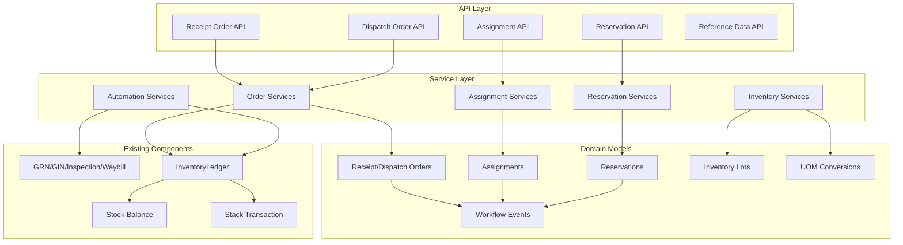
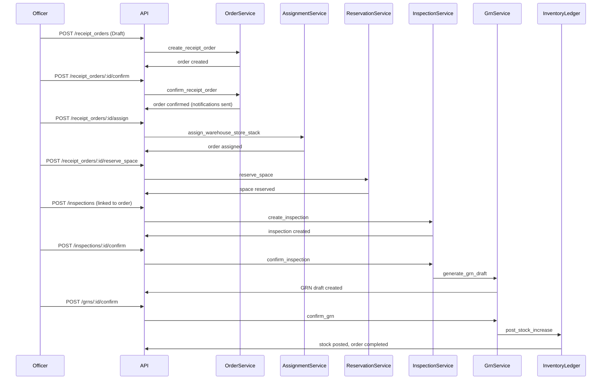
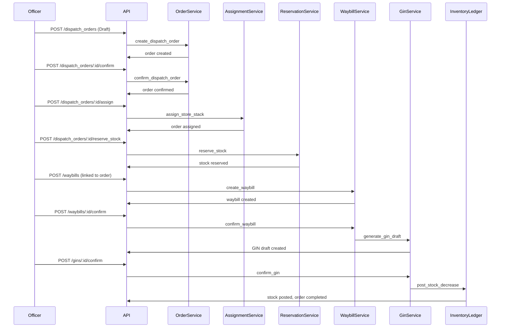
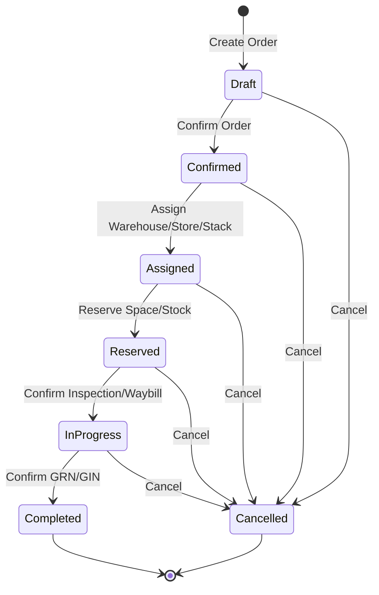

# Design Document: WMS Backend Phases

## Overview

This design document specifies the technical implementation for a three-phase Warehouse Management System (WMS) backend within the existing `Cats::Warehouse` Rails engine. The system introduces officer-driven orchestration of receipt and dispatch orders, inventory traceability through lot/expiry/UOM tracking, and manager/storekeeper assignment with reservation workflows.

### Design Goals

1. **Frontend-First API Design**: All APIs return complete display fields and action metadata to eliminate additional API calls
2. **Backward Compatibility**: All changes are additive with nullable columns to preserve existing functionality
3. **Transactional Consistency**: Stock operations maintain ACID properties and non-negative balances
4. **Role-Based Access Control**: Clear separation of responsibilities across Officer, Hub Manager, Warehouse Manager, and Store Keeper roles
5. **Workflow Automation**: Inspection-to-GRN and Waybill-to-GIN automation reduces manual data entry

### System Context

The WMS backend extends the existing `Cats::Warehouse` engine which already provides:
- Facility hierarchy: Hub → Warehouse → Store → Stack
- Document models: GRN, GIN, Inspection, Waybill
- Stock tracking: StockBalance, StackTransaction
- DocumentLifecycle concern for status management
- InventoryLedger service for stock posting

The new system adds orchestration layers on top of these existing components without breaking current functionality.

## Architecture

### High-Level Architecture



### Layered Architecture

The system follows a clean layered architecture:

1. **API Layer** (`app/controllers/cats/warehouse/v1/`): RESTful endpoints with consistent JSON:API-style responses
2. **Service Layer** (`app/services/cats/warehouse/`): Business logic, workflow orchestration, and automation
3. **Domain Layer** (`app/models/cats/warehouse/`): ActiveRecord models with validations and associations
4. **Data Layer**: PostgreSQL database with transactional guarantees

### Integration Points

- **DocumentLifecycle**: Extended to support new workflow states (Assigned, Reserved, In Progress)
- **InventoryLedger**: Enhanced to accept lot and UOM parameters
- **Notification System**: Integrated for order confirmation and assignment events
- **Authorization**: Pundit policies extended for new Officer role

## Components and Interfaces

### Core Domain Models

#### Receipt Order

Orchestrates inbound warehouse operations from creation through completion.

**Attributes:**
- `order_number` (string, unique): Auto-generated identifier
- `status` (enum): draft, confirmed, assigned, reserved, in_progress, completed, cancelled
- `source_type` (enum): purchase, transfer, donation, return
- `warehouse_id` (integer, foreign key): Target warehouse
- `hub_id` (integer, foreign key): Parent hub
- `notes` (text, optional): Additional information
- `created_by_id` (integer, foreign key): Officer who created the order
- `confirmed_by_id` (integer, foreign key, nullable): Officer who confirmed
- `confirmed_at` (datetime, nullable): Confirmation timestamp
- `completed_at` (datetime, nullable): Completion timestamp

**Associations:**
- `has_many :receipt_order_lines`
- `has_one :receipt_order_assignment`
- `has_many :space_reservations, through: :receipt_order_lines`
- `has_many :inspections`
- `has_many :grns`
- `has_many :workflow_events, as: :entity`
- `belongs_to :warehouse`
- `belongs_to :hub`
- `belongs_to :created_by, class_name: "Cats::Core::User"`
- `belongs_to :confirmed_by, class_name: "Cats::Core::User"`

**State Machine:**
```
Draft → Confirmed → Assigned → Reserved → In Progress → Completed
  ↓         ↓          ↓           ↓            ↓
Cancelled Cancelled Cancelled  Cancelled   Cancelled
```

#### Receipt Order Line

Line items for receipt orders specifying commodity and quantity expectations.

**Attributes:**
- `receipt_order_id` (integer, foreign key)
- `commodity_id` (integer, foreign key)
- `quantity` (decimal)
- `unit_id` (integer, foreign key)
- `notes` (text, optional)

**Associations:**
- `belongs_to :receipt_order`
- `belongs_to :commodity, class_name: "Cats::Core::Commodity"`
- `belongs_to :unit, class_name: "Cats::Core::UnitOfMeasure"`
- `has_many :space_reservations`

#### Dispatch Order

Orchestrates outbound warehouse operations from creation through completion.

**Attributes:**
- `order_number` (string, unique): Auto-generated identifier
- `status` (enum): draft, confirmed, assigned, reserved, in_progress, completed, cancelled
- `destination_type` (enum): distribution_center, warehouse, beneficiary, other
- `destination_id` (integer, nullable): Polymorphic destination reference
- `warehouse_id` (integer, foreign key): Source warehouse
- `notes` (text, optional)
- `created_by_id`, `confirmed_by_id`, `confirmed_at`, `completed_at` (same as Receipt Order)

**Associations:** Similar to Receipt Order with dispatch-specific relationships

#### Inventory Lot

Traceability record linking stock to batch number and expiry date.

**Attributes:**
- `warehouse_id` (integer, foreign key)
- `commodity_id` (integer, foreign key)
- `batch_no` (string): Batch/lot identifier
- `expiry_date` (date): Product expiration date
- `created_at`, `updated_at`

**Unique Index:** `(warehouse_id, commodity_id, batch_no, expiry_date)`

**Associations:**
- `belongs_to :warehouse`
- `belongs_to :commodity`
- `has_many :stock_balances`
- `has_many :grn_items`
- `has_many :gin_items`

#### UOM Conversion

Unit of measure conversion rules for commodity-specific conversions.

**Attributes:**
- `commodity_id` (integer, foreign key, nullable): Specific commodity or null for global
- `from_unit_id` (integer, foreign key)
- `to_unit_id` (integer, foreign key)
- `conversion_factor` (decimal): Multiplier to convert from_unit to to_unit

**Unique Index:** `(commodity_id, from_unit_id, to_unit_id)`

**Associations:**
- `belongs_to :commodity, optional: true`
- `belongs_to :from_unit, class_name: "Cats::Core::UnitOfMeasure"`
- `belongs_to :to_unit, class_name: "Cats::Core::UnitOfMeasure"`

#### Receipt Order Assignment

Tracks warehouse, store, and stack assignments for receipt orders.

**Attributes:**
- `receipt_order_id` (integer, foreign key, unique)
- `assigned_warehouse_id` (integer, foreign key)
- `assigned_store_id` (integer, foreign key, nullable)
- `assigned_stack_id` (integer, foreign key, nullable)
- `assigned_by_id` (integer, foreign key)
- `assigned_at` (datetime)

#### Dispatch Order Assignment

Tracks store and stack assignments for dispatch orders.

**Attributes:** Similar to Receipt Order Assignment (without warehouse level)

#### Space Reservation

Reserves storage capacity for incoming receipt orders.

**Attributes:**
- `receipt_order_line_id` (integer, foreign key)
- `store_id` (integer, foreign key)
- `stack_id` (integer, foreign key)
- `commodity_id` (integer, foreign key)
- `reserved_quantity` (decimal)
- `reserved_unit_id` (integer, foreign key)
- `reserved_by_id` (integer, foreign key)
- `reserved_at` (datetime)
- `released_at` (datetime, nullable)

**Unique Index:** `(receipt_order_line_id, store_id, stack_id)`

#### Stock Reservation

Reserves specific stock quantities for outbound dispatch orders.

**Attributes:**
- `dispatch_order_line_id` (integer, foreign key)
- `store_id` (integer, foreign key)
- `stack_id` (integer, foreign key)
- `commodity_id` (integer, foreign key)
- `inventory_lot_id` (integer, foreign key, nullable)
- `reserved_quantity` (decimal)
- `reserved_unit_id` (integer, foreign key)
- `reserved_by_id` (integer, foreign key)
- `reserved_at` (datetime)
- `released_at` (datetime, nullable)

**Unique Index:** `(dispatch_order_line_id, inventory_lot_id, store_id, stack_id)`

#### Workflow Event

Audit trail for order state transitions and workflow actions.

**Attributes:**
- `entity_type` (string): Polymorphic type (ReceiptOrder, DispatchOrder)
- `entity_id` (integer): Polymorphic ID
- `event_type` (enum): order_created, order_confirmed, warehouse_assigned, space_reserved, etc.
- `from_state` (string, nullable)
- `to_state` (string)
- `user_id` (integer, foreign key)
- `notes` (text, optional)
- `occurred_at` (datetime)

**Index:** `(entity_type, entity_id, occurred_at)`

### Modified Existing Models

#### GRN (Goods Received Note)

**New Attributes:**
- `receipt_order_id` (integer, foreign key, nullable)
- `generated_from` (enum, nullable): inspection, manual
- `generated_at` (datetime, nullable)

#### GRN Item

**New Attributes:**
- `inventory_lot_id` (integer, foreign key, nullable)
- `entered_unit_id` (integer, foreign key, nullable)
- `base_unit_id` (integer, foreign key, nullable)
- `base_quantity` (decimal, nullable)

#### GIN (Goods Issue Note)

**New Attributes:**
- `dispatch_order_id` (integer, foreign key, nullable)
- `generated_from` (enum, nullable): waybill, manual
- `generated_at` (datetime, nullable)

#### GIN Item

**New Attributes:** Same as GRN Item plus:
- `stock_reservation_id` (integer, foreign key, nullable)

#### Inspection

**New Attributes:**
- `receipt_order_id` (integer, foreign key, nullable)

#### Inspection Item

**New Attributes:**
- `inventory_lot_id` (integer, foreign key, nullable)
- `entered_unit_id` (integer, foreign key, nullable)
- `base_unit_id` (integer, foreign key, nullable)
- `base_quantity` (decimal, nullable)

#### Waybill

**New Attributes:**
- `dispatch_order_id` (integer, foreign key, nullable)

#### Waybill Item

**New Attributes:** Same as Inspection Item

#### Stock Balance

**New Attributes:**
- `inventory_lot_id` (integer, foreign key, nullable)
- `base_unit_id` (integer, foreign key, nullable)
- `base_quantity` (decimal, nullable)
- `reserved_quantity` (decimal, default: 0)

**Modified Unique Index:** `(warehouse_id, store_id, stack_id, commodity_id, unit_id, inventory_lot_id)`

#### Stack Transaction

**New Attributes:**
- `inventory_lot_id` (integer, foreign key, nullable)
- `entered_unit_id` (integer, foreign key, nullable)
- `base_unit_id` (integer, foreign key, nullable)
- `base_quantity` (decimal, nullable)

### Service Layer Components

#### Order Services

**ReceiptOrderCreator**
- Creates receipt order with draft status
- Validates warehouse and commodity references
- Generates unique order number
- Records workflow event

**ReceiptOrderConfirmer**
- Validates all line items have positive quantities
- Transitions status from draft to confirmed
- Sends notifications to Hub Manager and Warehouse Manager
- Records workflow event
- Prevents modification after confirmation

**DispatchOrderCreator**
- Similar to ReceiptOrderCreator for dispatch orders

**DispatchOrderConfirmer**
- Similar to ReceiptOrderConfirmer for dispatch orders

#### Assignment Services

**ReceiptOrderAssignmentService**
- Assigns warehouse by Hub Manager
- Assigns store/stack by Warehouse Manager
- Validates facility exists and is active
- Transitions status to assigned
- Records workflow event
- Sends notification to Store Keeper

**DispatchOrderAssignmentService**
- Assigns store/stack by Warehouse Manager
- Similar validation and notification logic

#### Reservation Services

**SpaceReservationService**
- Validates available capacity in assigned store/stack
- Creates space reservation records per order line
- Transitions receipt order status to reserved
- Records workflow event
- Calculates: available_capacity = total_capacity - used_capacity - reserved_capacity

**StockReservationService**
- Validates available stock in assigned store/stack
- Allows selection of specific inventory lots
- Creates stock reservation records per order line
- Transitions dispatch order status to reserved
- Records workflow event
- Enforces FEFO (First Expiry First Out) when suggesting lots
- Calculates: available_stock = total_stock - reserved_stock

#### Automation Services

**GrnGeneratorFromInspection**
- Triggered when inspection linked to receipt order is confirmed
- Copies accepted quantities from inspection items to GRN items
- Preserves lot and UOM information
- Links GRN to source inspection and receipt order
- Sets generated_from = 'inspection'
- Transitions receipt order status to in_progress
- Records workflow event

**GinGeneratorFromWaybill**
- Triggered when waybill linked to dispatch order is confirmed
- Copies quantities from waybill items to GIN items
- Preserves lot and UOM information from stock reservations
- Links GIN to source waybill and dispatch order
- Sets generated_from = 'waybill'
- Transitions dispatch order status to in_progress
- Records workflow event

#### Inventory Services

**InventoryLotResolver**
- Finds or creates inventory lot based on warehouse, commodity, batch, expiry
- Returns existing lot if combination matches
- Creates new lot if no match found
- Validates expiry date is in the future

**UomConversionResolver**
- Finds conversion factor between two units for a commodity
- Falls back to global conversions if commodity-specific not found
- Returns 1.0 if from_unit == to_unit
- Returns nil if no conversion exists
- Calculates: base_quantity = entered_quantity * conversion_factor

**WorkflowEventRecorder**
- Creates workflow event records for all state transitions
- Captures user, timestamp, from/to states, and notes
- Provides audit trail for compliance

## Data Models

### Database Schema

#### New Tables

**cats_warehouse_receipt_orders**
```sql
CREATE TABLE cats_warehouse_receipt_orders (
  id BIGSERIAL PRIMARY KEY,
  order_number VARCHAR(50) NOT NULL UNIQUE,
  status VARCHAR(20) NOT NULL DEFAULT 'draft',
  source_type VARCHAR(20) NOT NULL,
  warehouse_id BIGINT NOT NULL REFERENCES cats_warehouse_warehouses(id),
  hub_id BIGINT NOT NULL REFERENCES cats_warehouse_hubs(id),
  notes TEXT,
  created_by_id BIGINT NOT NULL REFERENCES cats_core_users(id),
  confirmed_by_id BIGINT REFERENCES cats_core_users(id),
  confirmed_at TIMESTAMP,
  completed_at TIMESTAMP,
  created_at TIMESTAMP NOT NULL,
  updated_at TIMESTAMP NOT NULL,
  
  CONSTRAINT check_status CHECK (status IN ('draft', 'confirmed', 'assigned', 'reserved', 'in_progress', 'completed', 'cancelled')),
  CONSTRAINT check_source_type CHECK (source_type IN ('purchase', 'transfer', 'donation', 'return'))
);

CREATE INDEX idx_receipt_orders_status ON cats_warehouse_receipt_orders(status);
CREATE INDEX idx_receipt_orders_warehouse ON cats_warehouse_receipt_orders(warehouse_id);
CREATE INDEX idx_receipt_orders_hub ON cats_warehouse_receipt_orders(hub_id);
CREATE INDEX idx_receipt_orders_created_by ON cats_warehouse_receipt_orders(created_by_id);
```

**cats_warehouse_receipt_order_lines**
```sql
CREATE TABLE cats_warehouse_receipt_order_lines (
  id BIGSERIAL PRIMARY KEY,
  receipt_order_id BIGINT NOT NULL REFERENCES cats_warehouse_receipt_orders(id) ON DELETE CASCADE,
  commodity_id BIGINT NOT NULL REFERENCES cats_core_commodities(id),
  quantity DECIMAL(15,3) NOT NULL,
  unit_id BIGINT NOT NULL REFERENCES cats_core_unit_of_measures(id),
  notes TEXT,
  created_at TIMESTAMP NOT NULL,
  updated_at TIMESTAMP NOT NULL
);

CREATE INDEX idx_receipt_order_lines_order ON cats_warehouse_receipt_order_lines(receipt_order_id);
CREATE INDEX idx_receipt_order_lines_commodity ON cats_warehouse_receipt_order_lines(commodity_id);
```

**cats_warehouse_dispatch_orders**
```sql
CREATE TABLE cats_warehouse_dispatch_orders (
  id BIGSERIAL PRIMARY KEY,
  order_number VARCHAR(50) NOT NULL UNIQUE,
  status VARCHAR(20) NOT NULL DEFAULT 'draft',
  destination_type VARCHAR(30) NOT NULL,
  destination_id BIGINT,
  warehouse_id BIGINT NOT NULL REFERENCES cats_warehouse_warehouses(id),
  notes TEXT,
  created_by_id BIGINT NOT NULL REFERENCES cats_core_users(id),
  confirmed_by_id BIGINT REFERENCES cats_core_users(id),
  confirmed_at TIMESTAMP,
  completed_at TIMESTAMP,
  created_at TIMESTAMP NOT NULL,
  updated_at TIMESTAMP NOT NULL,
  
  CONSTRAINT check_status CHECK (status IN ('draft', 'confirmed', 'assigned', 'reserved', 'in_progress', 'completed', 'cancelled')),
  CONSTRAINT check_destination_type CHECK (destination_type IN ('distribution_center', 'warehouse', 'beneficiary', 'other'))
);

CREATE INDEX idx_dispatch_orders_status ON cats_warehouse_dispatch_orders(status);
CREATE INDEX idx_dispatch_orders_warehouse ON cats_warehouse_dispatch_orders(warehouse_id);
```

**cats_warehouse_dispatch_order_lines**
```sql
CREATE TABLE cats_warehouse_dispatch_order_lines (
  id BIGSERIAL PRIMARY KEY,
  dispatch_order_id BIGINT NOT NULL REFERENCES cats_warehouse_dispatch_orders(id) ON DELETE CASCADE,
  commodity_id BIGINT NOT NULL REFERENCES cats_core_commodities(id),
  quantity DECIMAL(15,3) NOT NULL,
  unit_id BIGINT NOT NULL REFERENCES cats_core_unit_of_measures(id),
  notes TEXT,
  created_at TIMESTAMP NOT NULL,
  updated_at TIMESTAMP NOT NULL
);

CREATE INDEX idx_dispatch_order_lines_order ON cats_warehouse_dispatch_order_lines(dispatch_order_id);
```

**cats_warehouse_inventory_lots**
```sql
CREATE TABLE cats_warehouse_inventory_lots (
  id BIGSERIAL PRIMARY KEY,
  warehouse_id BIGINT NOT NULL REFERENCES cats_warehouse_warehouses(id),
  commodity_id BIGINT NOT NULL REFERENCES cats_core_commodities(id),
  batch_no VARCHAR(100) NOT NULL,
  expiry_date DATE NOT NULL,
  created_at TIMESTAMP NOT NULL,
  updated_at TIMESTAMP NOT NULL,
  
  CONSTRAINT unique_lot UNIQUE (warehouse_id, commodity_id, batch_no, expiry_date)
);

CREATE INDEX idx_inventory_lots_warehouse_commodity ON cats_warehouse_inventory_lots(warehouse_id, commodity_id);
CREATE INDEX idx_inventory_lots_expiry ON cats_warehouse_inventory_lots(expiry_date);
```

**cats_warehouse_uom_conversions**
```sql
CREATE TABLE cats_warehouse_uom_conversions (
  id BIGSERIAL PRIMARY KEY,
  commodity_id BIGINT REFERENCES cats_core_commodities(id),
  from_unit_id BIGINT NOT NULL REFERENCES cats_core_unit_of_measures(id),
  to_unit_id BIGINT NOT NULL REFERENCES cats_core_unit_of_measures(id),
  conversion_factor DECIMAL(15,6) NOT NULL,
  created_at TIMESTAMP NOT NULL,
  updated_at TIMESTAMP NOT NULL,
  
  CONSTRAINT unique_conversion UNIQUE (commodity_id, from_unit_id, to_unit_id),
  CONSTRAINT check_positive_factor CHECK (conversion_factor > 0)
);

CREATE INDEX idx_uom_conversions_commodity ON cats_warehouse_uom_conversions(commodity_id);
```

**cats_warehouse_receipt_order_assignments**
```sql
CREATE TABLE cats_warehouse_receipt_order_assignments (
  id BIGSERIAL PRIMARY KEY,
  receipt_order_id BIGINT NOT NULL UNIQUE REFERENCES cats_warehouse_receipt_orders(id) ON DELETE CASCADE,
  assigned_warehouse_id BIGINT NOT NULL REFERENCES cats_warehouse_warehouses(id),
  assigned_store_id BIGINT REFERENCES cats_warehouse_stores(id),
  assigned_stack_id BIGINT REFERENCES cats_warehouse_stacks(id),
  assigned_by_id BIGINT NOT NULL REFERENCES cats_core_users(id),
  assigned_at TIMESTAMP NOT NULL,
  created_at TIMESTAMP NOT NULL,
  updated_at TIMESTAMP NOT NULL
);

CREATE INDEX idx_receipt_assignments_order ON cats_warehouse_receipt_order_assignments(receipt_order_id);
```

**cats_warehouse_dispatch_order_assignments**
```sql
CREATE TABLE cats_warehouse_dispatch_order_assignments (
  id BIGSERIAL PRIMARY KEY,
  dispatch_order_id BIGINT NOT NULL UNIQUE REFERENCES cats_warehouse_dispatch_orders(id) ON DELETE CASCADE,
  assigned_store_id BIGINT NOT NULL REFERENCES cats_warehouse_stores(id),
  assigned_stack_id BIGINT NOT NULL REFERENCES cats_warehouse_stacks(id),
  assigned_by_id BIGINT NOT NULL REFERENCES cats_core_users(id),
  assigned_at TIMESTAMP NOT NULL,
  created_at TIMESTAMP NOT NULL,
  updated_at TIMESTAMP NOT NULL
);

CREATE INDEX idx_dispatch_assignments_order ON cats_warehouse_dispatch_order_assignments(dispatch_order_id);
```

**cats_warehouse_space_reservations**
```sql
CREATE TABLE cats_warehouse_space_reservations (
  id BIGSERIAL PRIMARY KEY,
  receipt_order_line_id BIGINT NOT NULL REFERENCES cats_warehouse_receipt_order_lines(id) ON DELETE CASCADE,
  store_id BIGINT NOT NULL REFERENCES cats_warehouse_stores(id),
  stack_id BIGINT NOT NULL REFERENCES cats_warehouse_stacks(id),
  commodity_id BIGINT NOT NULL REFERENCES cats_core_commodities(id),
  reserved_quantity DECIMAL(15,3) NOT NULL,
  reserved_unit_id BIGINT NOT NULL REFERENCES cats_core_unit_of_measures(id),
  reserved_by_id BIGINT NOT NULL REFERENCES cats_core_users(id),
  reserved_at TIMESTAMP NOT NULL,
  released_at TIMESTAMP,
  created_at TIMESTAMP NOT NULL,
  updated_at TIMESTAMP NOT NULL,
  
  CONSTRAINT unique_space_reservation UNIQUE (receipt_order_line_id, store_id, stack_id)
);

CREATE INDEX idx_space_reservations_line ON cats_warehouse_space_reservations(receipt_order_line_id);
CREATE INDEX idx_space_reservations_stack ON cats_warehouse_space_reservations(stack_id);
```

**cats_warehouse_stock_reservations**
```sql
CREATE TABLE cats_warehouse_stock_reservations (
  id BIGSERIAL PRIMARY KEY,
  dispatch_order_line_id BIGINT NOT NULL REFERENCES cats_warehouse_dispatch_order_lines(id) ON DELETE CASCADE,
  store_id BIGINT NOT NULL REFERENCES cats_warehouse_stores(id),
  stack_id BIGINT NOT NULL REFERENCES cats_warehouse_stacks(id),
  commodity_id BIGINT NOT NULL REFERENCES cats_core_commodities(id),
  inventory_lot_id BIGINT REFERENCES cats_warehouse_inventory_lots(id),
  reserved_quantity DECIMAL(15,3) NOT NULL,
  reserved_unit_id BIGINT NOT NULL REFERENCES cats_core_unit_of_measures(id),
  reserved_by_id BIGINT NOT NULL REFERENCES cats_core_users(id),
  reserved_at TIMESTAMP NOT NULL,
  released_at TIMESTAMP,
  created_at TIMESTAMP NOT NULL,
  updated_at TIMESTAMP NOT NULL,
  
  CONSTRAINT unique_stock_reservation UNIQUE (dispatch_order_line_id, inventory_lot_id, store_id, stack_id)
);

CREATE INDEX idx_stock_reservations_line ON cats_warehouse_stock_reservations(dispatch_order_line_id);
CREATE INDEX idx_stock_reservations_lot ON cats_warehouse_stock_reservations(inventory_lot_id);
```

**cats_warehouse_workflow_events**
```sql
CREATE TABLE cats_warehouse_workflow_events (
  id BIGSERIAL PRIMARY KEY,
  entity_type VARCHAR(50) NOT NULL,
  entity_id BIGINT NOT NULL,
  event_type VARCHAR(50) NOT NULL,
  from_state VARCHAR(20),
  to_state VARCHAR(20) NOT NULL,
  user_id BIGINT NOT NULL REFERENCES cats_core_users(id),
  notes TEXT,
  occurred_at TIMESTAMP NOT NULL,
  created_at TIMESTAMP NOT NULL,
  
  CONSTRAINT check_event_type CHECK (event_type IN (
    'order_created', 'order_confirmed', 'warehouse_assigned', 'store_assigned',
    'space_reserved', 'stock_reserved', 'inspection_confirmed', 'grn_confirmed',
    'waybill_confirmed', 'gin_confirmed', 'order_completed', 'order_cancelled'
  ))
);

CREATE INDEX idx_workflow_events_entity ON cats_warehouse_workflow_events(entity_type, entity_id, occurred_at);
CREATE INDEX idx_workflow_events_user ON cats_warehouse_workflow_events(user_id);
```

#### Schema Modifications to Existing Tables

**cats_warehouse_grns**
```sql
ALTER TABLE cats_warehouse_grns
  ADD COLUMN receipt_order_id BIGINT REFERENCES cats_warehouse_receipt_orders(id),
  ADD COLUMN generated_from VARCHAR(20),
  ADD COLUMN generated_at TIMESTAMP;

CREATE INDEX idx_grns_receipt_order ON cats_warehouse_grns(receipt_order_id);
```

**cats_warehouse_grn_items**
```sql
ALTER TABLE cats_warehouse_grn_items
  ADD COLUMN inventory_lot_id BIGINT REFERENCES cats_warehouse_inventory_lots(id),
  ADD COLUMN entered_unit_id BIGINT REFERENCES cats_core_unit_of_measures(id),
  ADD COLUMN base_unit_id BIGINT REFERENCES cats_core_unit_of_measures(id),
  ADD COLUMN base_quantity DECIMAL(15,3);

CREATE INDEX idx_grn_items_lot ON cats_warehouse_grn_items(inventory_lot_id);
```

**cats_warehouse_gins**
```sql
ALTER TABLE cats_warehouse_gins
  ADD COLUMN dispatch_order_id BIGINT REFERENCES cats_warehouse_dispatch_orders(id),
  ADD COLUMN generated_from VARCHAR(20),
  ADD COLUMN generated_at TIMESTAMP;

CREATE INDEX idx_gins_dispatch_order ON cats_warehouse_gins(dispatch_order_id);
```

**cats_warehouse_gin_items**
```sql
ALTER TABLE cats_warehouse_gin_items
  ADD COLUMN inventory_lot_id BIGINT REFERENCES cats_warehouse_inventory_lots(id),
  ADD COLUMN entered_unit_id BIGINT REFERENCES cats_core_unit_of_measures(id),
  ADD COLUMN base_unit_id BIGINT REFERENCES cats_core_unit_of_measures(id),
  ADD COLUMN base_quantity DECIMAL(15,3),
  ADD COLUMN stock_reservation_id BIGINT REFERENCES cats_warehouse_stock_reservations(id);

CREATE INDEX idx_gin_items_lot ON cats_warehouse_gin_items(inventory_lot_id);
CREATE INDEX idx_gin_items_reservation ON cats_warehouse_gin_items(stock_reservation_id);
```

**cats_warehouse_inspections**
```sql
ALTER TABLE cats_warehouse_inspections
  ADD COLUMN receipt_order_id BIGINT REFERENCES cats_warehouse_receipt_orders(id);

CREATE INDEX idx_inspections_receipt_order ON cats_warehouse_inspections(receipt_order_id);
```

**cats_warehouse_inspection_items**
```sql
ALTER TABLE cats_warehouse_inspection_items
  ADD COLUMN inventory_lot_id BIGINT REFERENCES cats_warehouse_inventory_lots(id),
  ADD COLUMN entered_unit_id BIGINT REFERENCES cats_core_unit_of_measures(id),
  ADD COLUMN base_unit_id BIGINT REFERENCES cats_core_unit_of_measures(id),
  ADD COLUMN base_quantity DECIMAL(15,3);

CREATE INDEX idx_inspection_items_lot ON cats_warehouse_inspection_items(inventory_lot_id);
```

**cats_warehouse_waybills**
```sql
ALTER TABLE cats_warehouse_waybills
  ADD COLUMN dispatch_order_id BIGINT REFERENCES cats_warehouse_dispatch_orders(id);

CREATE INDEX idx_waybills_dispatch_order ON cats_warehouse_waybills(dispatch_order_id);
```

**cats_warehouse_waybill_items**
```sql
ALTER TABLE cats_warehouse_waybill_items
  ADD COLUMN inventory_lot_id BIGINT REFERENCES cats_warehouse_inventory_lots(id),
  ADD COLUMN entered_unit_id BIGINT REFERENCES cats_core_unit_of_measures(id),
  ADD COLUMN base_unit_id BIGINT REFERENCES cats_core_unit_of_measures(id),
  ADD COLUMN base_quantity DECIMAL(15,3);

CREATE INDEX idx_waybill_items_lot ON cats_warehouse_waybill_items(inventory_lot_id);
```

**cats_warehouse_stock_balances**
```sql
ALTER TABLE cats_warehouse_stock_balances
  ADD COLUMN inventory_lot_id BIGINT REFERENCES cats_warehouse_inventory_lots(id),
  ADD COLUMN base_unit_id BIGINT REFERENCES cats_core_unit_of_measures(id),
  ADD COLUMN base_quantity DECIMAL(15,3),
  ADD COLUMN reserved_quantity DECIMAL(15,3) DEFAULT 0;

-- Drop old unique constraint
ALTER TABLE cats_warehouse_stock_balances
  DROP CONSTRAINT IF EXISTS unique_stock_balance;

-- Add new unique constraint including lot
ALTER TABLE cats_warehouse_stock_balances
  ADD CONSTRAINT unique_stock_balance_with_lot 
  UNIQUE (warehouse_id, store_id, stack_id, commodity_id, unit_id, inventory_lot_id);

CREATE INDEX idx_stock_balances_lot ON cats_warehouse_stock_balances(inventory_lot_id);
```

**cats_warehouse_stack_transactions**
```sql
ALTER TABLE cats_warehouse_stack_transactions
  ADD COLUMN inventory_lot_id BIGINT REFERENCES cats_warehouse_inventory_lots(id),
  ADD COLUMN entered_unit_id BIGINT REFERENCES cats_core_unit_of_measures(id),
  ADD COLUMN base_unit_id BIGINT REFERENCES cats_core_unit_of_measures(id),
  ADD COLUMN base_quantity DECIMAL(15,3);

CREATE INDEX idx_stack_transactions_lot ON cats_warehouse_stack_transactions(inventory_lot_id);
```

### Entity Relationship Diagram

```mermaid
erDiagram
    RECEIPT_ORDER ||--o{ RECEIPT_ORDER_LINE : contains
    RECEIPT_ORDER ||--o| RECEIPT_ORDER_ASSIGNMENT : has
    RECEIPT_ORDER ||--o{ INSPECTION : generates
    RECEIPT_ORDER ||--o{ GRN : generates
    RECEIPT_ORDER ||--o{ WORKFLOW_EVENT : tracks
    
    RECEIPT_ORDER_LINE ||--o{ SPACE_RESERVATION : reserves
    
    DISPATCH_ORDER ||--o{ DISPATCH_ORDER_LINE : contains
    DISPATCH_ORDER ||--o| DISPATCH_ORDER_ASSIGNMENT : has
    DISPATCH_ORDER ||--o{ WAYBILL : generates
    DISPATCH_ORDER ||--o{ GIN : generates
    DISPATCH_ORDER ||--o{ WORKFLOW_EVENT : tracks
    
    DISPATCH_ORDER_LINE ||--o{ STOCK_RESERVATION : reserves
    
    INVENTORY_LOT ||--o{ STOCK_BALANCE : tracks
    INVENTORY_LOT ||--o{ GRN_ITEM : receives
    INVENTORY_LOT ||--o{ GIN_ITEM : issues
    INVENTORY_LOT ||--o{ STOCK_RESERVATION : reserves
    
    WAREHOUSE ||--o{ RECEIPT_ORDER : receives
    WAREHOUSE ||--o{ DISPATCH_ORDER : dispatches
    WAREHOUSE ||--o{ INVENTORY_LOT : stores
    WAREHOUSE ||--o{ STOCK_BALANCE : maintains
    
    STORE ||--o{ SPACE_RESERVATION : provides
    STORE ||--o{ STOCK_RESERVATION : provides
    STACK ||--o{ SPACE_RESERVATION : provides
    STACK ||--o{ STOCK_RESERVATION : provides
    
    COMMODITY ||--o{ INVENTORY_LOT : identifies
    COMMODITY ||--o{ UOM_CONVERSION : converts
    
    UOM_CONVERSION }o--|| FROM_UNIT : from
    UOM_CONVERSION }o--|| TO_UNIT : to
```

### Data Flow Diagrams

#### Receipt Order Flow



#### Dispatch Order Flow



#### State Machine Diagram



## API Specifications

### API Response Structure

All API responses follow a consistent JSON:API-inspired structure:

```json
{
  "id": "string",
  "type": "string",
  "attributes": {
    "field_name": "value",
    "foreign_key_id": 123,
    "foreign_key_name": "Display Name"
  },
  "relationships": {
    "related_entity": []
  },
  "meta": {
    "allowed_actions": ["action1", "action2"],
    "workflow_state": "current_state",
    "additional_metadata": "value"
  }
}
```

### Receipt Order Endpoints

#### POST /cats_warehouse/v1/receipt_orders

Creates a new receipt order in draft status.

**Request Body:**
```json
{
  "source_type": "purchase",
  "warehouse_id": 5,
  "notes": "Quarterly procurement",
  "lines": [
    {
      "commodity_id": 10,
      "quantity": 1000,
      "unit_id": 3,
      "notes": "Premium grade"
    }
  ]
}
```

**Response (201 Created):**
```json
{
  "id": "123",
  "type": "receipt_order",
  "attributes": {
    "order_number": "RO-2025-001",
    "status": "draft",
    "source_type": "purchase",
    "warehouse_id": 5,
    "warehouse_name": "Central Warehouse",
    "hub_id": 2,
    "hub_name": "Regional Hub A",
    "notes": "Quarterly procurement",
    "created_at": "2025-01-15T10:30:00Z",
    "confirmed_at": null,
    "total_lines": 1
  },
  "relationships": {
    "lines": [
      {
        "id": "456",
        "commodity_id": 10,
        "commodity_name": "Wheat Flour",
        "commodity_code": "WF-001",
        "quantity": 1000,
        "unit_id": 3,
        "unit_name": "Quintal",
        "unit_abbreviation": "qt",
        "notes": "Premium grade"
      }
    ]
  },
  "meta": {
    "allowed_actions": ["edit", "confirm", "delete"],
    "workflow_state": "draft",
    "can_assign": false,
    "can_reserve": false
  }
}
```

**Validation Rules:**
- warehouse_id must exist and be active
- commodity_id must exist for each line
- unit_id must exist for each line
- quantity can be zero or positive in draft state

#### GET /cats_warehouse/v1/receipt_orders

Lists receipt orders with pagination and filtering.

**Query Parameters:**
- `status` (optional): Filter by status
- `warehouse_id` (optional): Filter by warehouse
- `page` (default: 1): Page number
- `per_page` (default: 20, max: 100): Items per page

**Response (200 OK):**
```json
{
  "data": [
    {
      "id": "123",
      "type": "receipt_order",
      "attributes": { "..." }
    }
  ],
  "meta": {
    "total_count": 50,
    "page": 1,
    "per_page": 20,
    "total_pages": 3
  }
}
```

#### GET /cats_warehouse/v1/receipt_orders/:id

Retrieves a single receipt order with full details.

**Response (200 OK):** Same structure as POST response with expanded relationships

#### POST /cats_warehouse/v1/receipt_orders/:id/confirm

Confirms a receipt order, transitioning from draft to confirmed status.

**Request Body:** Empty or optional notes

**Response (200 OK):**
```json
{
  "id": "123",
  "type": "receipt_order",
  "attributes": {
    "status": "confirmed",
    "confirmed_by_id": 50,
    "confirmed_by_name": "Officer John",
    "confirmed_at": "2025-01-15T11:00:00Z"
  },
  "meta": {
    "allowed_actions": ["view", "assign"],
    "workflow_state": "confirmed",
    "can_assign": true
  }
}
```

**Validation Rules:**
- Order must be in draft status
- All line items must have positive quantities
- User must have Officer role

#### POST /cats_warehouse/v1/receipt_orders/:id/assign

Assigns warehouse, store, and stack to a receipt order.

**Request Body:**
```json
{
  "assigned_warehouse_id": 5,
  "assigned_store_id": 15,
  "assigned_stack_id": 25
}
```

**Response (200 OK):** Order with assignment details in relationships

**Validation Rules:**
- Order must be in confirmed status
- Warehouse, store, and stack must exist and be active
- User must have Hub Manager or Warehouse Manager role

#### POST /cats_warehouse/v1/receipt_orders/:id/reserve_space

Reserves storage space for a receipt order.

**Request Body:** Empty (uses assigned location)

**Response (200 OK):** Order with space_reservations in relationships

**Validation Rules:**
- Order must be in assigned status
- Assigned store/stack must have sufficient available capacity
- User must have Store Keeper role

### Dispatch Order Endpoints

Similar structure to Receipt Order endpoints with dispatch-specific attributes.

#### POST /cats_warehouse/v1/dispatch_orders
#### GET /cats_warehouse/v1/dispatch_orders
#### GET /cats_warehouse/v1/dispatch_orders/:id
#### POST /cats_warehouse/v1/dispatch_orders/:id/confirm
#### POST /cats_warehouse/v1/dispatch_orders/:id/assign
#### POST /cats_warehouse/v1/dispatch_orders/:id/reserve_stock

**Reserve Stock Request Body:**
```json
{
  "reservations": [
    {
      "dispatch_order_line_id": 890,
      "inventory_lot_id": 888,
      "reserved_quantity": 500
    }
  ]
}
```

### Reference Data Endpoints

#### GET /cats_warehouse/v1/reference_data/lots

Returns inventory lots filtered by warehouse and commodity.

**Query Parameters:**
- `warehouse_id` (required)
- `commodity_id` (required)

**Response (200 OK):**
```json
{
  "data": [
    {
      "id": "888",
      "type": "inventory_lot",
      "attributes": {
        "warehouse_id": 5,
        "warehouse_name": "Central Warehouse",
        "commodity_id": 10,
        "commodity_name": "Wheat Flour",
        "batch_no": "BATCH-2025-001",
        "expiry_date": "2026-01-15",
        "days_until_expiry": 365,
        "is_expiring_soon": false,
        "total_quantity": 1000,
        "available_quantity": 500,
        "reserved_quantity": 500
      },
      "meta": {
        "selectable": true,
        "expiry_status": "good"
      }
    }
  ]
}
```

#### GET /cats_warehouse/v1/reference_data/uom_conversions

Returns UOM conversions filtered by commodity.

**Query Parameters:**
- `commodity_id` (optional): Specific commodity or global conversions

**Response (200 OK):**
```json
{
  "data": [
    {
      "id": "100",
      "type": "uom_conversion",
      "attributes": {
        "commodity_id": 10,
        "commodity_name": "Wheat Flour",
        "from_unit_id": 5,
        "from_unit_name": "Metric Ton",
        "to_unit_id": 3,
        "to_unit_name": "Quintal",
        "conversion_factor": 10.0
      }
    }
  ]
}
```

### Workflow Endpoints

#### GET /cats_warehouse/v1/receipt_orders/:id/workflow

Returns workflow event history for a receipt order.

**Response (200 OK):**
```json
{
  "data": [
    {
      "id": "event-1",
      "type": "workflow_event",
      "attributes": {
        "event_type": "order_created",
        "from_state": null,
        "to_state": "draft",
        "user_id": 50,
        "user_name": "Officer John",
        "occurred_at": "2025-01-15T10:30:00Z",
        "notes": "Initial order creation"
      }
    }
  ]
}
```

#### GET /cats_warehouse/v1/dispatch_orders/:id/workflow

Similar to receipt order workflow endpoint.

### Dashboard Endpoints

#### GET /cats_warehouse/v1/dashboard/officer

Returns officer dashboard with operational summaries.

**Response (200 OK):**
```json
{
  "id": "dashboard-officer",
  "type": "dashboard",
  "attributes": {
    "user_id": 50,
    "user_name": "Officer John",
    "role": "Officer"
  },
  "relationships": {
    "receipt_orders_summary": {
      "draft": 5,
      "confirmed": 3,
      "assigned": 2,
      "reserved": 1,
      "in_progress": 4,
      "completed": 20
    },
    "dispatch_orders_summary": {
      "draft": 3,
      "confirmed": 2,
      "assigned": 1,
      "reserved": 1,
      "in_progress": 2,
      "completed": 15
    },
    "stock_summary": [],
    "expiring_stock_alerts": [],
    "pending_assignments": {},
    "recent_events": []
  }
}
```

### Error Response Format

All errors follow a consistent structure:

```json
{
  "error": {
    "type": "validation_error",
    "message": "Validation failed",
    "details": [
      {
        "field": "quantity",
        "message": "must be greater than 0",
        "code": "invalid_value"
      }
    ]
  },
  "meta": {
    "request_id": "req-abc123",
    "timestamp": "2025-01-15T10:30:00Z"
  }
}
```

**HTTP Status Codes:**
- 200: Success
- 201: Created
- 400: Bad Request
- 401: Unauthorized
- 403: Forbidden
- 404: Not Found
- 422: Unprocessable Entity (validation errors)
- 500: Internal Server Error

## Error Handling

### Error Handling Strategy

The system implements a layered error handling approach:

1. **Validation Layer**: ActiveRecord validations and custom validators catch data integrity issues
2. **Service Layer**: Business logic errors with domain-specific error classes
3. **Controller Layer**: HTTP status code mapping and consistent error response formatting
4. **Transaction Layer**: Database transaction rollback on failures

### Error Classes

```ruby
module Cats::Warehouse
  module Errors
    class BaseError < StandardError; end
    
    class ValidationError < BaseError
      attr_reader :errors
      def initialize(errors)
        @errors = errors
        super("Validation failed")
      end
    end
    
    class InsufficientCapacityError < BaseError; end
    class InsufficientStockError < BaseError; end
    class InvalidStateTransitionError < BaseError; end
    class DuplicateOperationError < BaseError; end
    class AuthorizationError < BaseError; end
  end
end
```

### Error Response Mapping

| Error Class | HTTP Status | Error Type |
|------------|-------------|------------|
| ValidationError | 422 | validation_error |
| InsufficientCapacityError | 422 | insufficient_capacity |
| InsufficientStockError | 422 | insufficient_stock |
| InvalidStateTransitionError | 422 | invalid_state_transition |
| DuplicateOperationError | 409 | duplicate_operation |
| AuthorizationError | 403 | forbidden |
| ActiveRecord::RecordNotFound | 404 | not_found |
| StandardError | 500 | internal_server_error |

### Transaction Handling

All stock-posting operations use database transactions:

```ruby
ActiveRecord::Base.transaction do
  # Update stock balance
  # Create stack transaction
  # Update order status
  # Record workflow event
  # Release reservations
end
```

If any step fails, the entire transaction rolls back, maintaining data consistency.

### Validation Error Details

Validation errors include field-level details:

```json
{
  "error": {
    "type": "validation_error",
    "message": "Validation failed",
    "details": [
      {
        "field": "quantity",
        "message": "must be greater than 0",
        "code": "invalid_value"
      },
      {
        "field": "warehouse_id",
        "message": "does not exist",
        "code": "not_found"
      }
    ]
  }
}
```

## Testing Strategy

### Testing Approach

The system uses a dual testing approach combining unit tests and property-based tests:

**Unit Tests:**
- Specific examples demonstrating correct behavior
- Edge cases (empty inputs, boundary values)
- Error conditions and validation failures
- Integration points between components

**Property-Based Tests:**
- Universal properties that hold for all inputs
- Comprehensive input coverage through randomization
- State machine transitions
- Invariant preservation

### Test Coverage Requirements

- Minimum 80% code coverage for critical business logic
- 100% coverage for service layer classes
- All API endpoints must have integration tests
- All state transitions must have property tests

### Property-Based Testing Configuration

Using `rspec-propcheck` gem for Ruby property-based testing:

```ruby
# Gemfile
gem 'rspec-propcheck', group: :test

# spec/spec_helper.rb
require 'rspec/propcheck'

RSpec.configure do |config|
  config.include RSpec::Propcheck
end
```

Each property test runs minimum 100 iterations with randomized inputs.

### Test Organization

```
spec/
├── models/
│   ├── receipt_order_spec.rb
│   ├── dispatch_order_spec.rb
│   └── inventory_lot_spec.rb
├── services/
│   ├── receipt_order_creator_spec.rb
│   ├── grn_generator_from_inspection_spec.rb
│   └── stock_reservation_service_spec.rb
├── requests/
│   ├── receipt_orders_spec.rb
│   ├── dispatch_orders_spec.rb
│   └── reference_data_spec.rb
├── properties/
│   ├── order_workflow_properties_spec.rb
│   ├── stock_operations_properties_spec.rb
│   └── serialization_properties_spec.rb
└── support/
    ├── factories/
    └── generators/
```

### Property Test Examples

**Order Creation Property:**
```ruby
# Feature: wms-backend-phases, Property 1
property "all created receipt orders start with draft status" do
  forall(order_params: gen_receipt_order_params) do |params|
    order = ReceiptOrderCreator.new(params).call
    expect(order.status).to eq('draft')
  end
end
```

**Stock Non-Negativity Property:**
```ruby
# Feature: wms-backend-phases, Property 15
property "stock balances never go negative after any operation" do
  forall(
    initial_stock: gen_positive_decimal,
    operations: gen_stock_operations
  ) do |stock, ops|
    balance = create_stock_balance(quantity: stock)
    ops.each { |op| apply_operation(balance, op) }
    expect(balance.reload.quantity).to be >= 0
  end
end
```

### Unit Test Examples

**Validation Test:**
```ruby
describe ReceiptOrder do
  it "requires positive quantities for confirmation" do
    order = create(:receipt_order, :draft)
    order.lines.first.update(quantity: 0)
    
    expect { order.confirm! }.to raise_error(ValidationError)
  end
end
```

**Integration Test:**
```ruby
describe "POST /cats_warehouse/v1/receipt_orders" do
  it "creates a receipt order with draft status" do
    post "/cats_warehouse/v1/receipt_orders", params: valid_params
    
    expect(response).to have_http_status(:created)
    expect(json_response['attributes']['status']).to eq('draft')
  end
end
```

### Test Data Generators

Property tests use custom generators for domain objects:

```ruby
module Generators
  def gen_receipt_order_params
    Propcheck::Generators.hash(
      source_type: gen_source_type,
      warehouse_id: gen_existing_warehouse_id,
      lines: gen_order_lines
    )
  end
  
  def gen_inventory_lot
    Propcheck::Generators.hash(
      warehouse_id: gen_existing_warehouse_id,
      commodity_id: gen_existing_commodity_id,
      batch_no: gen_batch_number,
      expiry_date: gen_future_date
    )
  end
end
```

## Correctness Properties

*A property is a characteristic or behavior that should hold true across all valid executions of a system—essentially, a formal statement about what the system should do. Properties serve as the bridge between human-readable specifications and machine-verifiable correctness guarantees.*

### Property Reflection

After analyzing all acceptance criteria, I identified the following testable properties. I performed a reflection to eliminate redundancy:

**Redundancies Identified:**
- Requirements 1.10 and 2.10 both test positive quantity validation - combined into Property 2
- Requirements 10.3 and 29.5 both test capacity validation - combined into Property 9
- Requirements 11.3 and 30.4 both test stock availability validation - combined into Property 10
- Requirements 12.1 and 13.1 both test document automation - combined into Property 11
- Requirements 12.10 and 13.11 both test duplicate prevention - combined into Property 12

### Property 1: Draft Status Initialization

*For any* receipt order or dispatch order created through the API, the initial status SHALL be 'draft'.

**Validates: Requirements 1.2, 2.2**

### Property 2: Positive Quantity Validation

*For any* receipt order or dispatch order, when confirmation is attempted, all line items MUST have positive (> 0) quantities, otherwise confirmation SHALL be rejected.

**Validates: Requirements 1.10, 2.10**

### Property 3: API Response Structure Consistency

*For any* API endpoint response, the response SHALL contain id, type, attributes, relationships, and meta sections with all foreign key references including both ID and display name fields.

**Validates: Requirements 1.3, 15.1, 15.2**

### Property 4: Draft Mutability and Confirmed Immutability

*For any* order in draft status, updates to header and line data SHALL succeed; for any order in confirmed status, updates SHALL be rejected.

**Validates: Requirements 1.12, 1.13**

### Property 5: Referential Integrity Validation

*For any* order creation request, if warehouse_id, commodity_id, or unit_id references do not exist, the creation SHALL be rejected with validation errors.

**Validates: Requirements 1.11, 2.11**

### Property 6: Backward Compatibility for Manual Documents

*For any* GRN, GIN, Inspection, or Waybill created without an order link (receipt_order_id or dispatch_order_id is null), the document SHALL process normally as a manual workflow.

**Validates: Requirements 4.3, 16.2, 16.3, 16.4, 16.5**

### Property 7: Inventory Lot Uniqueness

*For any* combination of warehouse, commodity, batch number, and expiry date, only one inventory lot SHALL exist; attempts to create duplicates SHALL resolve to the existing lot.

**Validates: Requirements 5.2, 5.5**

### Property 8: UOM Conversion Calculation

*For any* document item with an entered unit different from the base unit, if a conversion exists, base_quantity SHALL equal entered_quantity × conversion_factor; if no conversion exists, base_unit_id SHALL equal entered_unit_id and base_quantity SHALL equal entered_quantity.

**Validates: Requirements 6.4, 6.5**

### Property 9: Capacity Validation

*For any* space reservation request, the available capacity (total_capacity - used_capacity - reserved_capacity) of the assigned store/stack MUST be greater than or equal to the requested quantity, otherwise the reservation SHALL be rejected.

**Validates: Requirements 10.3, 29.4, 29.5**

### Property 10: Stock Availability Validation

*For any* stock reservation request, the available stock (total_stock - reserved_stock) of the assigned store/stack/lot MUST be greater than or equal to the requested quantity, otherwise the reservation SHALL be rejected.

**Validates: Requirements 11.3, 30.3, 30.4**

### Property 11: Document Automation Generation

*For any* inspection linked to a receipt order that is confirmed, a GRN draft SHALL be generated with quantities copied from inspection items; for any waybill linked to a dispatch order that is confirmed, a GIN draft SHALL be generated with quantities copied from waybill items.

**Validates: Requirements 12.1, 12.2, 13.1**

### Property 12: Idempotent Document Generation

*For any* inspection or waybill, confirming it multiple times SHALL generate only one GRN or GIN draft; subsequent confirmation attempts SHALL not create duplicate documents.

**Validates: Requirements 12.10, 13.11**

### Property 13: State Transition Correctness

*For any* order, state transitions SHALL follow the defined state machine: Draft → Confirmed → Assigned → Reserved → In Progress → Completed, with transitions only allowed from the immediate predecessor state.

**Validates: Requirements 8.4, 10.4**

### Property 14: Transactional Stock Posting

*For any* GRN or GIN confirmation, if any step in the stock posting transaction fails (stock balance update, stack transaction creation, order status update), the entire transaction SHALL roll back and no partial changes SHALL persist.

**Validates: Requirements 21.1, 21.5**

### Property 15: Stock Non-Negativity Invariant

*For any* stock balance, after any operation (GRN confirmation, GIN confirmation, adjustment), the quantity SHALL remain greater than or equal to zero; attempts to reduce stock below zero SHALL be rejected.

**Validates: Requirements 21.3, 30.10**

### Property 16: Serialization Round-Trip

*For any* valid entity (receipt order, dispatch order, inventory lot, etc.), serializing to JSON, parsing back to an object, and serializing again SHALL produce equivalent JSON output.

**Validates: Requirements 25.8**

### Property 17: Workflow Event Recording

*For any* state transition, assignment, or reservation action, a workflow event SHALL be recorded with entity type, entity ID, event type, from/to states, user ID, and timestamp.

**Validates: Requirements 14.2, 14.3, 14.4, 14.5**

### Property 18: Action Metadata Correctness

*For any* order in a given status, the allowed_actions in the meta section SHALL match the permitted actions for that status: draft allows ["edit", "confirm", "delete"], confirmed allows ["view", "assign"], assigned allows ["view", "reserve"], etc.

**Validates: Requirements 1.4, 1.8**

### Property 19: Capacity Calculation Invariant

*For any* store or stack, the relationship available_capacity = total_capacity - used_capacity - reserved_capacity SHALL always hold true.

**Validates: Requirements 29.4**

### Property 20: Stock Availability Calculation Invariant

*For any* stock balance, the relationship available_quantity = total_quantity - reserved_quantity SHALL always hold true.

**Validates: Requirements 30.3**

## Implementation Notes

### Phase 1: Officer-Driven Orchestration

**Focus:** Receipt/dispatch order models, Officer role, basic workflow

**Key Deliverables:**
- Receipt Order and Dispatch Order models with state machine
- Order creation and confirmation services
- API endpoints for order CRUD operations
- Officer role integration
- Nullable foreign keys on existing documents

**Testing Priority:**
- Properties 1, 2, 3, 4, 5, 6, 18
- Unit tests for order creation and confirmation
- Integration tests for API endpoints

### Phase 2: Inventory Traceability

**Focus:** Lot/UOM tracking, enhanced stock reporting

**Key Deliverables:**
- Inventory Lot and UOM Conversion models
- Lot resolution and UOM conversion services
- Enhanced stock balance with lot tracking
- Reference data APIs for lots and conversions

**Testing Priority:**
- Properties 7, 8, 16, 19, 20
- Unit tests for lot resolution and UOM conversion
- Property tests for calculation invariants

### Phase 3: Assignment and Automation

**Focus:** Assignment workflows, reservations, automation

**Key Deliverables:**
- Assignment and Reservation models
- Assignment and Reservation services
- GRN/GIN generation automation
- Workflow event tracking
- Dashboard APIs

**Testing Priority:**
- Properties 9, 10, 11, 12, 13, 14, 15, 17
- Unit tests for automation services
- Property tests for transactional consistency
- Integration tests for end-to-end workflows

### Migration Strategy

1. **Schema Migrations:** All new columns are nullable to preserve existing data
2. **Data Backfill:** Optional backfill scripts for lot/UOM data on legacy stock
3. **Feature Flags:** Gradual rollout of order-driven workflows alongside manual workflows
4. **Rollback Plan:** All changes are additive; rollback involves disabling new endpoints

### Performance Considerations

- **Indexes:** All foreign keys and frequently queried fields have indexes
- **Eager Loading:** Use `includes` to prevent N+1 queries in API responses
- **Caching:** Reference data (commodities, units, warehouses) cached in Redis
- **Pagination:** All list endpoints support pagination with max 100 items per page
- **Query Optimization:** Use database views for complex aggregations (stock summaries, capacity calculations)

### Security Considerations

- **Authentication:** All endpoints require valid JWT token
- **Authorization:** Pundit policies enforce role-based access control
- **Input Validation:** All user inputs sanitized and validated
- **SQL Injection Prevention:** Use parameterized queries exclusively
- **Audit Trail:** Workflow events provide complete audit trail
- **Rate Limiting:** API rate limiting to prevent abuse

## Conclusion

This design provides a comprehensive technical specification for implementing the WMS Backend Phases feature. The system maintains backward compatibility while adding powerful orchestration, traceability, and automation capabilities. The frontend-first API design ensures efficient UI development, and the property-based testing approach ensures correctness across all scenarios.
