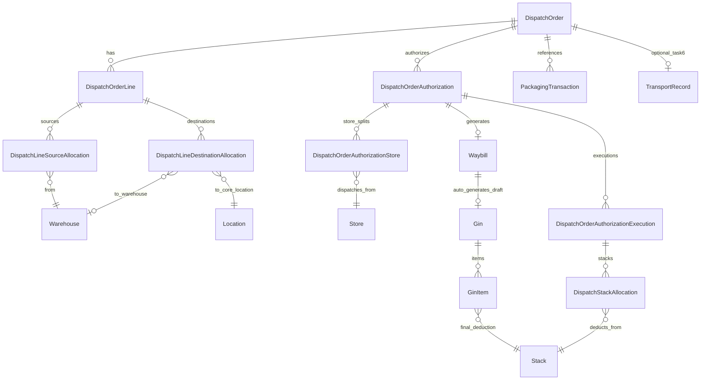
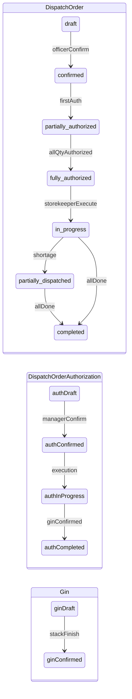
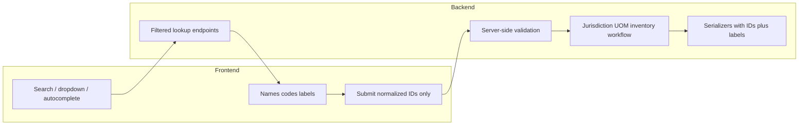
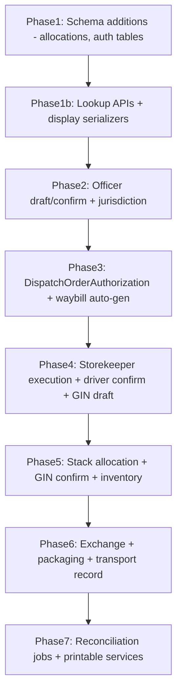

# Rails Backend Sprint Plan — Full Dispatch Domain

> **Scope:** Rails backend only. No frontend. No production code. Plan incorporates sprint Tasks 2–4/6–7 **and** the extended end-to-end dispatch workflow (sections 1–11).

---

## 1. Current Backend Architecture Analysis

### What already exists (reusable)

| Area | Existing artifact | Reuse strategy |
|------|-------------------|----------------|
| Warehouse hierarchy | `Warehouse → Store → Stack → StockBalance` | Keep as physical inventory anchor |
| Dispatch header/lines | `DispatchOrder`, `DispatchOrderLine` | Extend; do not replace |
| Document lifecycle | `DocumentLifecycle` + `ContractConstants::DOCUMENT_STATUS_TRANSITIONS` | Extend transition map for new statuses |
| UOM conversion | `UomConversion`, `UomConversionResolver` | Mandatory for all quantity math |
| Inventory mutation | `InventoryLedger.apply_issue!` / `apply_receipt!`, `StackTransaction` | Final deduction path on GIN confirm |
| Stock reservation | `StockReservation`, `StockReservationService` | Soft-hold at authorization confirm; hard issue at GIN confirm |
| Waybill pipeline | `WaybillCreator`, `WaybillConfirmer`, `WaybillTransport`, `WaybillPreparationService` | Auto-generate from confirmed authorization |
| GIN pipeline | `GinCreator`, `GinGeneratorFromWaybill`, `GinConfirmer` | Draft on driver confirm; inventory on GIN confirm |
| Inbound mirror | `ReceiptAuthorization` (transport, partial qty, storekeeper assignment, driver confirm, GRN) | **Template for new `DispatchOrderAuthorization`** |
| Audit | `WorkflowEvent`, `WorkflowEventRecorder` | Mandatory on every transition |
| Notifications | `NotificationFanout`, `InAppNotifications::Creator`, `NotificationJob` | Sync in-app + optional async webhook |
| Authorization | Pundit policies + `AccessContext` officer location scopes | Extend; never trust client jurisdiction |
| Officer tagging | `LocationTagger`, `hierarchical_level` on orders | Extend with immutable jurisdiction snapshot |

### What is missing (must introduce)

| Gap | Impact |
|-----|--------|
| **`DispatchOrderAuthorization` entity** | No outbound equivalent of `ReceiptAuthorization` in warehouse engine (Core has separate `cats_core_dispatch_authorizations` tied to truck `Dispatch`) |
| **Per-line source/destination allocations** | Current model is single `warehouse`/`destination` on header; cannot express many-to-many per commodity |
| **`plan_reference` (mandatory external ref)** | Only optional `reference_no` (system) exists |
| **Officer draft vs confirmed semantics** | `draft` exists but confirm validations/allocation locking incomplete |
| **Officer self-approval guard** | Creator can confirm without explicit ownership enforcement |
| **Dispatch execution + shortage tracking** | No storekeeper execution record with partial qty + mandatory shortage reason |
| **Stack-level final allocation before GIN confirm** | `GinItem` supports stack but no orchestrated multi-stack allocation service |
| **Quality/grade at dispatch execution** | Not modeled on outbound movement |
| **Cross-warehouse exchange** | `TransferRequest` forbids cross-warehouse |
| **Unified `PackagingTransaction`** | Packaging fragmented across receipt/inspection/transfer |
| **Bridge to Core dispatch planning** | `DispatchOrder` has no `dispatch_plan_id`; Core already has `cats_core_dispatch_plans` / items |

### Cats::Core engine — reuse vs duplicate (critical)

`cats_core` is an external gem (locked ~1.5.31); models live in the gem, tables in `db/schema.rb`. **Do not introduce warehouse tables that mirror Core.**

| Core artifact | Table / model | Warehouse plan action |
|---------------|---------------|------------------------|
| **FDP** | `cats_core_locations` where `location_type = FDP` (`Cats::Core::Location::FDP`) | **Do NOT** add `cats_warehouse_fdps` or `Fdp` model. Reference `location_id` → `cats_core_locations`. |
| **Hub / warehouse (planning)** | `Location::HUB`, `Location::WAREHOUSE` on same table | Operational facilities remain `cats_warehouse_hubs` / `cats_warehouse_warehouses` keyed by `location_id`. |
| **Dispatch plan (planning)** | `cats_core_dispatch_plans`, `cats_core_dispatch_plan_items` (`source_id`/`destination_id` → locations) | Optional nullable `dispatch_plan_id` / `dispatch_plan_item_id` on `DispatchOrder` for traceability — **do not** duplicate plan tables. |
| **Dispatch (truck trip)** | `cats_core_dispatches` (`Cats::Core::Dispatch`) | `Waybill` already `belongs_to :dispatch` (optional). Create/link Core `Dispatch` when waybill is generated if integration required. |
| **Dispatch authorization (store release)** | `cats_core_dispatch_authorizations` (FK → `cats_core_dispatches`, `cats_core_stores`) | **Name collision risk.** Warehouse outbound auth must be **`DispatchOrderAuthorization`** (`cats_warehouse_dispatch_order_authorizations`), **not** `DispatchAuthorization`. |
| **Dispatch transactions (stack picks)** | `cats_core_dispatch_transactions` | Warehouse storekeeper execution uses `DispatchOrderAuthorizationExecution` + `GinItem`/`StackTransaction` via `InventoryLedger` — **do not** duplicate Core transaction table unless explicitly bridging. |
| **Commodity / UOM / transporter / user** | `cats_core_commodities`, `cats_core_unit_of_measures`, `cats_core_transporters`, `cats_core_users` | Reuse FKs (already on warehouse lines). |
| **UOM conversions** | `cats_core_unit_conversions` **and** `cats_warehouse_uom_conversions` | Keep `UomConversionResolver` (warehouse) as canonical for engine math; do not add third conversion table. |
| **Legacy core stores/stacks** | `cats_core_stores`, `cats_core_stacks` | **Inactive** for warehouse API; use `cats_warehouse_stores` / `cats_warehouse_stacks` only. |

**Naming clarity for APIs/docs:**
- **Dispatch plan** → Core `DispatchPlan` / `DispatchPlanItem`
- **Dispatch order** → Warehouse `DispatchOrder` (officer orchestration)
- **Dispatch (truck)** → Core `Cats::Core::Dispatch`
- **Dispatch order authorization** → Warehouse `DispatchOrderAuthorization` (manager/storekeeper outbound workflow)

### Technical debt relevant to this sprint

- **Status casing drift:** services set `"Completed"`, `"Reserved"` while `DocumentLifecycle` uses lowercase symbols — normalize in all new services.
- **`update_columns` bypass:** risks skipping validations in legacy paths; new code must use guarded transitions only.
- **`DispatchOrderAssignment` overloaded:** currently hub/warehouse/store assignment to order lines — **not** the same as manager authorization; introduce `DispatchOrderAuthorization` (avoid Core `cats_core_dispatch_authorizations` name collision).
- **Core vs warehouse dispatch authorization:** two different aggregates — document and enforce in code review checklist.
- **No server-side quantity reconciliation** at authorization layer (same weakness noted in cats-ang reference analysis).

### cats-ang reference (architecture only)

- **Adopt:** printable DTO services (`PrintableService` pattern) for waybill/GIN document generation decoupled from serializers.
- **Reject:** client-side role filtering as authorization source.
- **Keep prototypelogistics as canonical** for Pundit, `DocumentLifecycle`, `InventoryLedger`, `WorkflowEventRecorder`.

---

## 2. Gap Analysis Against Sprint Requirements

### Task 1 / Task 5 — Pass
No backend work.

### Task 2 — Officer dispatch by level
| Support | Gap |
|---------|-----|
| Partial | `AccessContext#officer_location_scope_ids`, `DispatchOrderPolicy#level_excluded?` | No creation-time jurisdiction guard on **each source/destination allocation**; no eligible-warehouse API contract |

### Task 3 — Officer self-approves
| Support | Gap |
|---------|-----|
| Implicit | `POST dispatch_orders/:id/confirm` exists | No `approved_by == created_by` enforcement; no owner-only scope; conflates "confirm" with generic document confirm |

### Task 4 — Cross-warehouse exchange
| Support | Gap |
|---------|-----|
| None | `TransferRequest` same-warehouse only | Need exchange inferred from warehouse-only destinations + destination receipt flow + multi-source allocations |

### Task 6 — Manager transport details
| Support | Gap |
|---------|-----|
| Partial | `WaybillTransport` on waybill creation | No manager-scoped transport capture on approved order without status change; must reconcile with authorization transport fields |

### Task 7 — Packaging receive/dispatch
| Support | Gap |
|---------|-----|
| Fragmented | receipt line packaging, transfer `package_count` | No `packaging_transactions` table or unified poster service |

### Extended workflow (sections 1–11)
| Support | Gap |
|---------|-----|
| Partial header/lines | `DispatchOrderCreator` | Missing `plan_reference`, packaging on lines, allocation join models, authorization layer, execution layer |
| Partial waybill/GIN | Existing services | Not wired to authorization-centric flow; driver confirm step missing on outbound |

---

## 3. End-to-End Domain Entity Model

### Entity relationship map



### Entities — exist vs introduce

#### A. `DispatchOrder` (EXTEND existing)
**Purpose:** Officer-owned dispatch request header.

| Field | Type | Notes |
|-------|------|-------|
| `plan_reference` | string, **NOT NULL** | External planning ref; alphanumeric/mixed; **not** system `reference_no` |
| `description` | text, optional | Long-form detail |
| `reference_no` | string, unique | System-generated document number (separate from plan_reference) |
| `created_by_id` | FK User | Officer |
| `officer_level` | string enum | Snapshot: federal/regional/zone/woreda/kebele |
| `officer_location_id` | FK Location | Immutable jurisdiction anchor |
| `status` | enum | See lifecycle §5 |
| `confirmed_by_id`, `confirmed_at` | FK, timestamp | Officer confirmation (Task 3 self-approve) |
| `approved_by_id`, `approved_at` | FK, timestamp | Alias/same as confirmed for sprint Task 3 |
| `jurisdiction_metadata` | jsonb | Snapshot of scope IDs at creation |
| `dispatch_plan_id` | FK, optional | Link to `cats_core_dispatch_plans` for traceability (do not duplicate plan tables) |
| `dispatch_plan_item_id` | FK, optional | Link to `cats_core_dispatch_plan_items` when order derives from Core planning |

**Validations:**
- `plan_reference` presence, max length (e.g. 100), strip whitespace; **no format restriction** (supports numeric/alphanumeric/mixed).
- `reference_no` uniqueness when present (system-generated).
- `officer_level` derived server-side from role; reject client override mismatch.
- All source/destination warehouses in allocations must pass jurisdiction guard before confirm.

**Indexes:**
- `(plan_reference)` — lookup/reporting (non-unique; external refs may repeat across periods).
- `(created_by_id, status)`, `(officer_level, status)`.
- `(reference_no)` unique partial where not null.

**Uniqueness:** Do **not** globally unique `plan_reference` (external systems may reuse); optionally unique per `(officer_location_id, plan_reference)` if business requires — confirm with stakeholders; default: non-unique with audit.

**Audit:** `WorkflowEvent` on create, update (draft only), confirm, cancel.

---

#### B. `DispatchOrderLine` (EXTEND existing)
**Purpose:** One commodity request row.

| Field | Notes |
|-------|-------|
| `commodity_id`, `unit_id` | Request UOM |
| `quantity` | Requested qty in entered UOM |
| `base_unit_id`, `base_quantity` | Normalized via `UomConversionResolver` |
| `packaging_unit_id`, `packaging_size`, `package_count` | Calculated server-side |
| `remarks` | Optional |

**Validations:**
- `quantity > 0`.
- `base_quantity` computed on save via `UomConversionResolver.convert!`; reject if no conversion path.
- `package_count = (base_quantity / packaging_size).ceil` when packaging_size present; store rounding mode (`ceil`) explicitly.

**UOM strategy:**
- **Entered UOM:** what officer enters.
- **Base UOM:** commodity's `unit_of_measure_id`; all reconciliation sums in base UOM.
- **Precision:** use `decimal(18,6)` columns (existing migration direction); round display in serializers only.
- **Inventory compatibility:** allocation/reservation checks compare `base_quantity` against `StockBalance.base_quantity`.

---

#### C. `DispatchLineSourceAllocation` (NEW)
**Purpose:** Per-line quantity from a source warehouse (hub-attached or independent).

| Field | Notes |
|-------|-------|
| `dispatch_order_line_id` | FK |
| `warehouse_id` | FK (hub warehouse or independent) |
| `quantity`, `unit_id` | Entered qty |
| `base_quantity`, `base_unit_id` | Normalized |
| `warehouse_ownership_type` | denormalized snapshot: hub/independent |

**Validations:**
- Sum of `base_quantity` per line ≤ line `base_quantity` (draft); **must equal** on confirm.
- Warehouse active; officer jurisdiction scope.
- Commodity stock exists at warehouse (soft check on confirm, hard check at authorization).

---

#### D. `DispatchLineDestinationAllocation` (NEW)
**Purpose:** Per-line quantity to destination warehouse or FDP.

| Field | Notes |
|-------|-------|
| `dispatch_order_line_id` | FK |
| `destination_location_id` | FK → `cats_core_locations.id` |
| `destination_location_type` | denormalized snapshot: `Warehouse` or `FDP` (from `Cats::Core::Location`) |
| `quantity`, `unit_id`, `base_quantity`, `base_unit_id` | Normalized |

**Validations:**
- Sum destination `base_quantity` per line must equal source sum per line on confirm.
- Destination location must exist, `location_type` in `[Cats::Core::Location::WAREHOUSE, Cats::Core::Location::FDP]`, and pass officer jurisdiction.
- FDP destinations: resolve via `Cats::Core::Location` (see §K); validate `name`, `code`, `active` semantics (below).
- Cross-warehouse exchange (Task 4): inferred when **all** destination allocations have `destination_location_type == WAREHOUSE` (warehouse-to-warehouse only).

---

#### E. `DispatchOrderAuthorization` (NEW — mirror `ReceiptAuthorization`; **not** Core `DispatchAuthorization`)
**Purpose:** Warehouse manager authorizes outbound movement for their warehouse; separates order intent from executable dispatch.

**Why separate from order:**
- One order spans many warehouses; each manager authorizes only their slice.
- Supports partial authorization across time.
- Own lifecycle, transport, waybill, storekeeper assignment.
- Prevents order-level transport from blocking multi-warehouse flows.

| Field | Notes |
|-------|-------|
| `dispatch_order_id` | FK |
| `warehouse_id` | Authorizing manager's warehouse |
| `reference_no` | System unique |
| `status` | draft/confirmed/in_progress/completed/cancelled |
| `authorized_quantity` | Total for this authorization (entered UOM) |
| `authorized_base_quantity` | Normalized |
| `authorized_quantity_input_unit_id` | UOM |
| `remaining_quantity` | Denormalized counter |
| `transporter_id` | FK |
| `driver_name`, `driver_id_number`, `truck_plate_number` | Required on confirm |
| `transporter_name` | denormalized snapshot |
| `created_by_id` | Warehouse manager |
| `confirmed_by_id`, `confirmed_at` | Manager confirm |

**Associations:**
- `has_many :dispatch_order_authorization_stores`
- `has_one :waybill`
- `has_many :dispatch_order_authorization_executions`
- `has_many :workflow_events, as: :entity`

---

#### F. `DispatchOrderAuthorizationStore` (NEW)
**Purpose:** Store-level split within one authorization (manager selects dispatching stores).

| Field | Notes |
|-------|-------|
| `dispatch_order_authorization_id` | FK |
| `store_id` | FK |
| `commodity_id` | FK |
| `authorized_quantity`, `base_quantity` | Per store |
| `dispatched_quantity` | Running total |
| `remaining_quantity` | Counter |

**Validations:**
- Sum per authorization ≤ `authorized_quantity`.
- Store belongs to authorization warehouse.
- Multiple stores per authorization allowed.

---

#### G. `DispatchOrderAuthorizationExecution` (NEW)
**Purpose:** Storekeeper records actual dispatch against authorization store.

| Field | Notes |
|-------|-------|
| `dispatch_order_authorization_id` | FK |
| `dispatch_order_authorization_store_id` | FK |
| `storekeeper_id` | FK |
| `commodity_id`, `quantity`, `base_quantity` | Actual dispatched |
| `authorized_quantity` | Snapshot |
| `shortage_quantity` | Computed if actual < authorized |
| `shortage_reason` | **Required** if shortage_quantity > 0 |
| `commodity_grade` | Quality/grade at execution |
| `inventory_lot_id` | Optional traceability |
| `status` | draft/confirmed |

**Quality/grade placement:** Capture on **execution record** and copy to **`GinItem`** and **`StackTransaction` metadata** at GIN confirm. Grade is a property of **this movement**, not the stack permanently (unless stack/lot already has grade — validate compatibility).

---

#### H. `DispatchStackAllocation` (NEW)
**Purpose:** Final stack selection before GIN confirm (step 11).

| Field | Notes |
|-------|-------|
| `dispatch_order_authorization_execution_id` or `gin_id` | FK (prefer link to execution pre-GIN, copied to GinItem) |
| `stack_id` | FK |
| `quantity`, `base_quantity` | Per stack |
| `commodity_grade` | Optional override per stack |

**Validations:**
- Sum per execution = execution quantity.
- Stack belongs to store; stack commodity compatible.
- `InventoryLedger` non-negative guard.

---

#### I. `TransportRecord` (NEW — Task 6)
**Purpose:** Optional lightweight manager transport capture on approved order **before** full authorization (sprint Task 6).

| Field | Notes |
|-------|-------|
| `dispatch_order_id`, `warehouse_id` | FK |
| `driver_name`, `license_number`, `vehicle_plate`, `phone` | |
| `recorded_by_id` | Manager |

**Architectural resolution with §6:** Task 6 record is **staging**; on `DispatchOrderAuthorization` create, copy transport fields into authorization (or require authorization create to supersede transport record). Waybill reads from **confirmed authorization**, not raw transport record.

---

#### J. `PackagingTransaction` (NEW — Task 7)
See §6.

---

#### K. FDP destinations (reuse `Cats::Core::Location` — **no new table**)

FDP is **not** a separate model. Use `Cats::Core::Location` with `location_type: FDP` (`cats_core_locations`).

| Attribute | Source | Notes |
|-----------|--------|-------|
| `name` | `cats_core_locations.name` | Required on location |
| `code` | `cats_core_locations.code` | Required for FDP identity (seeded in `db/seeds.rb`) |
| `location_id` | `cats_core_locations.id` | FK on `DispatchLineDestinationAllocation.destination_location_id` |
| `active` | Application rule | **Not a column on `cats_core_locations` today.** Treat as: location exists, valid parent chain per `cats_core_location_extensions.rb`, and not superseded/cancelled in warehouse workflows. If hard `active` flag is required later, extend Core Location in gem — **do not** add `cats_warehouse_fdps`. |

**Jurisdiction:** same officer scope rules as warehouses — FDP location must fall within `AccessContext#officer_location_scope_ids`.

**Operational mapping:** FDP has no `cats_warehouse_*` facility row; inventory receipt at FDP uses delivery confirmation (not stack), not warehouse `Store`/`Stack`.

---

### Reused entities (minimal extension)

- **`Cats::Core::Location`:** all FDP/hub/warehouse planning destinations.
- **`Cats::Core::Commodity`, `UnitOfMeasure`, `Transporter`, `User`:** master data FKs.
- **`Cats::Core::Dispatch` (optional):** link from `Waybill#dispatch_id` when truck record is created.
- **`Waybill` / `WaybillItem` / `WaybillTransport`:** generated from confirmed `DispatchOrderAuthorization`.
- **`Gin` / `GinItem`:** draft after driver confirm; confirmed after stack allocation + finish dispatch.
- **`StockReservation`:** link to `dispatch_order_authorization_id` + line + store + stack.
- **`StackTransaction`:** created by `InventoryLedger` on GIN confirm.

---

## 4. Extended Workflow — Backend Behavior (Sections 1–11)

### §1 Officer creates dispatch order

**Flow:**
1. Officer calls `POST /dispatch_orders` with header + nested lines + allocations.
2. `DispatchOrderCreatorForOfficer` derives `officer_level`, `officer_location_id`, `jurisdiction_metadata` from `AccessContext` — **ignores client values**.
3. Order saved as `status: draft`.
4. `WorkflowEventRecorder`: `dispatch_order.created`.

**Draft behavior:** All nested lines/allocations editable via `PATCH /dispatch_orders/:id` while draft.

**API request structure (conceptual):**
```json
{
  "plan_reference": "RP-2026-03-WHEAT-001",
  "description": "...",
  "lines": [{
    "commodity_id": 1, "quantity": 500, "unit_id": 2,
    "packaging_unit_id": 3, "packaging_size": 50,
    "source_allocations": [{ "warehouse_id": 10, "quantity": 300, "unit_id": 2 }, { "warehouse_id": 11, "quantity": 200, "unit_id": 2 }],
    "destination_allocations": [{ "destination_location_id": 20, "quantity": 500, "unit_id": 2 }]
  }]
}
```

---

### §2 Commodity line items

- One order → many lines (existing association).
- Server computes `base_quantity`, `package_count` on each line save.
- Reject lines without at least one source and one destination allocation (on confirm, not draft save).

---

### §3 Source & destination warehouse allocation (many-to-many per line)

**Join models:** `DispatchLineSourceAllocation`, `DispatchLineDestinationAllocation`.

**Reconciliation service:** `DispatchAllocationReconciler`
- Per line: `sum(source.base_quantity) == sum(destination.base_quantity) == line.base_quantity`.
- Per order: aggregate commodity totals for reporting.
- **Over-allocation prevention:** DB check constraint impossible for sums — enforce in service with row lock on line:
  ```sql
  SELECT ... FROM dispatch_order_lines WHERE id = ? FOR UPDATE
  ```
- **Cross-warehouse:** allowed when all warehouses in officer jurisdiction; exchange type requires warehouse-to-warehouse destinations only.

**Inventory implication at this stage:** None — planning only. Availability checked at authorization confirm.

---

### §4 Draft → Confirm workflow

**Officer confirm** (`POST /dispatch_orders/:id/confirm` or `/self_approve` for Task 3):

**Preconfirm validations:**
- `plan_reference` present.
- All lines complete with balanced allocations.
- Jurisdiction re-validated (warehouses may have moved/deactivated since draft).
- Creator == actor (Task 3).

**On confirm — immutable:**
- Header: `plan_reference`, officer snapshot, all line commodity/qty, all allocations.
- Editable after confirm: none on order body (cancel only).

**Status transition:** `draft → confirmed` (maps to Task 3 `pending → approved` — **normalize to `confirmed`** in codebase per `DocumentLifecycle`).

**Transactional boundary:**
```ruby
DispatchOrder.transaction do
  order.lock!
  order.ensure_confirmable!
  DispatchAllocationReconciler.call(order)
  DispatchOrderJurisdictionGuard.call(order, actor)
  order.update!(status: confirmed, confirmed_by: actor, confirmed_at: Time.current)
  WorkflowEventRecorder.record!(...)
  NotificationFanout.deliver("dispatch_order.confirmed", ...)
end
```

**Notifications (async optional):**
- Recipients: warehouse managers for **each source warehouse** in allocations.
- Event: `dispatch_order.confirmed`.
- Implementation: `NotificationFanout` → `InAppNotifications::Creator` (sync) + `NotificationJob` (webhook retry if enabled).
- Payload: `{ dispatch_order_id, warehouse_ids: [...], plan_reference }`.

---

### §5 Warehouse managers receive & authorize

**Visibility:** `DispatchOrderAuthorizationPolicy::Scope` — managers see orders where their `warehouse_id` appears in source allocations and order is `confirmed+`.

**List endpoint:** `GET /dispatch_order_authorizations?warehouse_id=&status=`

**Relationship:** `DispatchOrder has_many :dispatch_order_authorizations`

---

### §6 Dispatch authorization process

**Create** (`POST /dispatch_order_authorizations`):
- Manager selects dispatch order (scoped), enters transporter + driver + plate + authorized qty + store splits.
- Status: `draft`.

**Partial authorization:**
- Multiple authorizations per order allowed.
- Service `DispatchOrderAuthorizationQuantityLedger` tracks `sum(authorized_base_quantity)` per `(order, warehouse, commodity)` ≤ allocated source qty for that warehouse.
- Row lock on order line allocations during create.

**Confirm authorization** (`POST /dispatch_order_authorizations/:id/confirm`):
- Validates transport fields complete.
- Validates store splits sum = authorized qty.
- Optional: `StockReservationService` soft-reserve against warehouse balances (recommended at confirm, not at order confirm).
- Status: `confirmed`.
- Triggers waybill generation (§7).

**Task 6 integration:** If `TransportRecord` exists for `(order, warehouse)`, pre-fill authorization transport fields; manager still confirms via authorization.

---

### §7 Waybill generation (automatic on authorization confirm)

**Service:** `DispatchOrderAuthorizationWaybillGenerator` (wraps `WaybillCreator`; optionally create/link `Cats::Core::Dispatch` on `Waybill#dispatch_id`)

**Transactional boundary:** Same transaction as authorization confirm:
1. Lock authorization.
2. Validate confirm preconditions.
3. Create reservations (optional sub-transaction).
4. Create waybill + waybill_items + waybill_transport from authorization.
5. Update authorization status → `confirmed`.
6. Record workflow events.
7. After commit: notify storekeepers.

**Numbering:** `ReferenceNumberGenerator.for(:waybill)` — unique `reference_no`; pattern configurable (e.g. `WB-{warehouse_code}-{yyyyMMdd}-{seq}`).

**Document generation architecture:**
- **API data:** serializers for waybill/GIN JSON.
- **Printable DTO:** new `WaybillPrintableService` (cats-ang pattern) — eager-load graph, flat hash for DOCX/PDF template.
- **Endpoint:** `POST /printables/waybill` (future); sprint minimum: persist waybill entity + audit event.

**Notifications:** `waybill.created` → assigned storekeepers on authorization stores.

---

### §8 Storekeeper dispatch execution

**Visibility:** `GET /dispatch_order_authorizations?storekeeper_scope=me&status=confirmed` — scoped via `DispatchOrderAuthorizationStore` → storekeeper store assignments (no `assigned_storekeeper_id` on authorization header).

**Execute** (`POST /dispatch_order_authorizations/:id/executions`):
- Select authorization store row.
- Enter actual `quantity` (≤ authorized remaining).
- If `quantity < remaining`: **`shortage_reason` required**.
- Status: `draft` until submitted.

**Reconciliation:**
- Update `dispatch_order_authorization_store.dispatched_quantity`.
- Update `dispatch_order_authorization.remaining_quantity`.
- Update order status → `partially_dispatched` when any shortfall or partial; → `in_progress`.

**Over-dispatch prevention:** reject if `actual > remaining` (422).

---

### §9 Commodity quality / grade

- **Stored on:** `DispatchOrderAuthorizationExecution.commodity_grade` (primary).
- **Copied to:** `GinItem` (reporting), `StackTransaction` payload/notes (audit).
- **Not stored on:** stack permanently unless stack already enforces single-grade — validate `stack.commodity_grade` compatibility if column exists.
- **Traceability:** optional `inventory_lot_id` links grade to lot batch.

---

### §10 Driver confirmation & GIN draft generation

**Flow** (`POST /dispatch_order_authorizations/:id/driver_confirm`):
- Mirror `ReceiptAuthorization#driver_confirm` pattern.
- Preconditions: execution draft exists with qty > 0.
- Creates **draft GIN** via `GinGeneratorFromWaybill` or new `GinGeneratorFromAuthorization`.
- GIN contains: dispatch details, commodities, quantities, warehouse/store, transporter, authorization ref, timestamps.
- **No inventory movement yet.**
- Status: authorization → `in_progress`; GIN → `draft`.

---

### §11 Stack selection & final dispatch (GIN confirm)

**Flow** (`POST /gins/:id/stack_allocations` then `POST /gins/:id/confirm`):

1. Storekeeper assigns one or many `DispatchStackAllocation` rows per GIN item.
2. `GinStackAllocationValidator`: sums match GIN item quantities; stacks have sufficient available (considering reservations).
3. **Finish dispatch** = `GinConfirmer` (extend existing):
   - Single `Gin.transaction` with row locks on stacks, balances, reservations.
   - For each stack allocation → `GinItem` with stack_id.
   - `InventoryLedger.apply_issue!` per item.
   - Update `StockReservation.issued_quantity` → `Consumed`.
   - Create `StackTransaction` (via ledger).
   - Update bin card / stock balance (existing ledger path).
   - GIN → `confirmed`.
   - Authorization → `completed` when all stores fully dispatched or shortfall accepted.
   - Order → `completed` when all authorizations terminal.

**Rollback:** Any failure in transaction rolls back all stack/balance/reservation changes.

**Concurrency:**
- `Stack.lock`, `StockBalance.lock` (via `InventoryLedger#locked_balance`).
- Idempotency key on `POST /gins/:id/confirm` (`Idempotency-Key` header) stored in `workflow_events` or dedicated table.

---

## 5. Dispatch Status Lifecycle (All Entities)

### Mechanism recommendation
**Extend `DocumentLifecycle` enum + service-orchestrated transitions.** Do not add state machine gem this sprint. Custom statuses for `DispatchOrderAuthorization` follow `ReceiptAuthorization` string-enum pattern OR migrate to `DocumentLifecycle` if transitions align.

### DispatchOrder statuses

| Status | Meaning | Who sets |
|--------|---------|----------|
| `draft` | Officer editing | Officer |
| `confirmed` | Officer confirmed (Task 3 self-approve) | Creator officer |
| `partially_authorized` | Some warehouse auths exist | System |
| `fully_authorized` | All source qty authorized | System |
| `in_progress` | At least one execution started | System |
| `partially_dispatched` | Shortfall or partial execution | System |
| `completed` | All authorizations terminal | System |
| `cancelled` | Cancelled before completion | Officer/admin |

**Transitions:**
- `draft → confirmed`: officer confirm (Task 3)
- `confirmed → partially_authorized`: first authorization confirmed
- `partially_authorized → fully_authorized`: allocation fully covered
- `* → in_progress`: first storekeeper execution
- `* → partially_dispatched`: shortage recorded
- `* → completed`: all auth completed
- `draft|confirmed → cancelled`: officer (policy)

### DispatchOrderAuthorization statuses
`draft → confirmed → in_progress → completed | cancelled`

### Waybill statuses
`draft → confirmed` (on authorization confirm, waybill created as draft; confirm may be immediate)

### GIN statuses
`draft` (driver confirm) → `confirmed` (finish dispatch / stack confirm)

### PackagingTransaction statuses
`posted` (single state); void via compensating negative transaction (no hard delete).



---

## 6. Packaging Architecture Plan (Task 7)

### `packaging_transactions` table
| Field | Notes |
|-------|-------|
| `transaction_type` | enum: `receive`, `dispatch` |
| `warehouse_id`, `commodity_id` | |
| `quantity`, `base_quantity`, `unit_id` | UOM normalized |
| `packaging_unit_id`, `packaging_size`, `package_count` | |
| `occurred_at` | timestamp |
| `reference_order_type`, `reference_order_id` | DispatchOrder or DispatchOrderAuthorization |
| `dispatch_order_authorization_execution_id` | Optional finer link |
| `created_by_id` | |
| `status` | `posted` / `voided` |

### Mode behavior
- **receive:** inbound exchange goods at destination warehouse — `InventoryLedger.apply_receipt!` OR packaging-only log if physical receipt already via GIN (config flag: `PACKAGING_AFFECTS_INVENTORY`).
- **dispatch:** outbound packaging log linked to authorization execution — audit layer; inventory already deducted via GIN.

### Reconciliation
- Nightly job: `PackagingReconciliationJob` compares `sum(packaging_transactions)` vs GIN items vs authorization executions per reference.

---

## 7. Detailed Sprint Task Mapping (Tasks 2–4, 6–7)

### Task 2 — Officer dispatch by level
- Implement `DispatchOrderJurisdictionGuard` called on create/update/confirm.
- `GET /dispatch_orders/lookups/source_warehouses` and `lookups/destinations` (display labels + jurisdiction filter); writes still accept IDs only.
- Persist `officer_level`, `officer_location_id`, `jurisdiction_metadata`.
- Reject warehouses outside level scope with 403 + clear error code `JURISDICTION_VIOLATION`.

### Task 3 — Self-approve
- `POST /dispatch_orders/:id/self_approve` → same as confirm with `created_by_id == current_user.id` guard.
- `GET /dispatch_orders?created_by=me&status=draft|confirmed` — officers see only own orders for approval queue.
- Policy: `approve?` false for non-creator.

### Task 4 — Exchange orders
- Exchange inferred when all `DispatchLineDestinationAllocation` rows have `destination_location_type == Cats::Core::Location::WAREHOUSE` (warehouse-to-warehouse; no FDP destinations).
- Destinations must be `Warehouse`; sources and destinations within jurisdiction.
- Self-approve via Task 3 flow.
- Receiving: `POST /dispatch_orders/:id/receive` at destination creates `PackagingTransaction(receive)` + optional `InventoryLedger.apply_receipt!` when destination accepts stock.

### Task 6 — Manager transport record
- `TransportRecord` on approved/confirmed orders.
- No status change on dispatch order.
- Data copied forward into `DispatchOrderAuthorization` on auth create.

### Task 7 — Packaging
- Unified `PackagingTransaction` model + poster service as §6.

---

## 8. Authorization Chain (Full)

| Step | Actor | Policy check |
|------|-------|--------------|
| Create draft order | Officer | `DispatchOrderPolicy#create?` + jurisdiction |
| Edit draft | Creator officer | `update?` owner + draft |
| Confirm/self-approve | Creator officer | `confirm?` owner + draft |
| View confirmed order | Manager (source warehouse) | scope on warehouse in allocations |
| Create authorization | Warehouse manager | warehouse match + order confirmed |
| Confirm authorization | Same manager | `DispatchOrderAuthorizationPolicy#confirm?` |
| Record transport (Task 6) | Manager | warehouse scope + order confirmed |
| Execute dispatch | Storekeeper | assigned to authorization store |
| Driver confirm | Storekeeper/manager | authorization in_progress |
| Stack allocate + GIN confirm | Storekeeper | `GinPolicy#confirm?` + stack scope |
| Cancel | Officer (draft/confirmed), Admin | policy |

**Jurisdiction map:**
- Federal → all warehouses/FDPs in system.
- Regional → warehouses whose location region = officer region.
- Zone → zone match.
- Kebele → kebele match (note: codebase uses Woreda level in `ContractConstants` — align kebele to existing `Location` hierarchy).

---

## 9. Inventory Integrity & Stock Movement Architecture

### Deduction timeline

| Stage | Inventory effect |
|-------|------------------|
| Order draft/confirm | None |
| Authorization confirm | Optional `StockReservation` (soft hold) |
| Execution record | None (operational record only) |
| GIN draft (driver confirm) | None |
| GIN confirm (finish dispatch) | **Hard deduction** via `InventoryLedger.apply_issue!` |

### Protections

| Risk | Mitigation |
|------|------------|
| Negative stock | `InventoryLedger#ensure_non_negative!`; reservation checks available |
| Duplicate dispatch | Idempotency key on GIN confirm; GIN status guard |
| Race conditions | Row locks on order, authorization, stack, balance |
| UOM inconsistency | All sums in `base_quantity`; `UomConversionResolver.convert!` raises on missing conversion |
| Partial transaction corruption | Single AR transaction per confirm; no `update_columns` in new paths |
| Over-authorization | `DispatchOrderAuthorizationQuantityLedger` with locked counters |
| Over-dispatch | Execution remaining qty checks |

### Bin card / stock movement
- `StackTransaction` records reference to GIN (existing ledger behavior).
- Extend serializer/report queries to include `dispatch_order_authorization_id`, `plan_reference`.

---

## 10. Notifications & Event Flow

| Event | Recipients | Sync/async |
|-------|------------|------------|
| `dispatch_order.confirmed` | Source warehouse managers | Sync in-app + async webhook |
| `dispatch_order_authorization.created` | Storekeepers on linked stores (via `DispatchOrderAuthorizationStore`) | Sync |
| `dispatch_order_authorization.confirmed` | Storekeepers on linked stores | Sync |
| `waybill.created` | Storekeepers, manager | Sync |
| `gin.draft_generated` | Storekeeper, manager | Sync |
| `gin.confirmed` | Officer creator, managers | Sync (existing pattern) |
| `packaging_transaction.posted` | Warehouse manager | Sync |

**Retry/failure:** `NotificationJob` retries with exponential backoff when `ENABLE_WAREHOUSE_JOBS=true`; in-app always written synchronously first.

---

## 11. Auditability Requirements

| Layer | Mechanism |
|-------|-----------|
| Status history | `WorkflowEvent` on every transition (entity, from_status, to_status, actor, payload) |
| Authorization history | Events on authorization create/confirm/execution |
| Stock history | `StackTransaction` + `StockBalance` versions |
| Document history | Waybill/GIN workflow_status + events |
| Officer actions | Immutable `jurisdiction_metadata`, `officer_level` snapshot |
| Shortage audit | `shortage_reason` required + event payload |

**API:** `GET /dispatch_orders/:id/workflow` (exists — extend payload).

---

## 12. Multi-Warehouse Coordination

- One order, N source warehouses → N managers independently create authorizations (partial OK).
- Order status derived: `DispatchOrderStatusAggregator` service recalculates from authorization counters.
- Distributed deduction: each authorization's GIN confirm deducts only from its warehouse stacks.
- Destination receipt (exchange): destination warehouse manager creates `PackagingTransaction(receive)` or inbound GRN analog when stock enters destination.

---

## 13. FDP vs Warehouse Dispatch (Attribute Diff)

| Attribute | Warehouse exchange | FDP dispatch |
|-----------|-------------------|--------------|
| Destination type | `Cats::Core::Location::WAREHOUSE` | `Cats::Core::Location::FDP` |
| Destination receipt | Stack/inventory increment | Delivery confirmation record (no stack) |
| Authorization | Manager at source warehouse | Manager at source warehouse |
| Inventory | Source deduct; dest increment | Source deduct only |
| Tracking | StackTransaction both sides | FDP delivery proof fields |

**FDP required attributes (on `Cats::Core::Location`, type FDP):** `name`, `code`, `location_id`, `active` (see §K for `active` semantics on Core Location), plus jurisdiction scope validation.

---

## 14. Frontend Integration & API Contract Rules

> **Scope note:** This plan remains backend-only. This section defines how Rails APIs must be shaped so a frontend can integrate without duplicating business logic. The frontend displays names/codes; the backend owns rules, math, and authorization.

### Architectural split (non-negotiable)



| Layer | Responsibility |
|-------|----------------|
| **Frontend** | Render searchable selectors; store selected IDs; submit IDs in write payloads; show API errors |
| **Backend** | Filter datasets by role/jurisdiction; validate every ID and relationship; compute UOM, packages, reconciliation, inventory; enforce workflow transitions |

**Frontend must NEVER:**
- Ask users to manually type warehouse/store/stack/commodity/UOM/transporter/authorization/GIN IDs
- Implement jurisdiction filtering, UOM conversion, package count math, allocation reconciliation, inventory checks, permission checks, or allowed status transitions

**Backend must ALWAYS:**
- Treat write payloads as untrusted (IDs may be forged or stale)
- Re-validate jurisdiction, ownership, and relationships on every mutating action
- Reject invalid combinations with explicit error codes regardless of frontend behavior

### Correct write pattern

1. User selects **"Bole Hub Warehouse (WH-001)"** in UI (from lookup API).
2. Frontend stores `warehouse_id: 42` internally.
3. Frontend submits `{ "source_allocations": [{ "warehouse_id": 42, "quantity": 100, "unit_id": 3 }] }`.
4. Backend validates `warehouse_id` exists, is active, and is within officer jurisdiction; computes `base_quantity`; persists.

---

## 14.1 API Design Expectations

### Write requests (mutations)

- Accept **normalized IDs** only for entity references (`warehouse_id`, `store_id`, `stack_id`, `commodity_id`, `unit_id`, `transporter_id`, `destination_location_id`, etc.).
- Accept **human-entered text** only for free-form fields (`plan_reference`, `description`, `driver_name`, `shortage_reason`, `remarks`).
- Never require the client to send derived fields (`base_quantity`, `package_count`, `officer_level`, `remaining_quantity`, status transitions) unless explicitly documented as optional hints — server recomputes and overwrites.

### Read responses (all dispatch-related serializers)

Every resource and nested association must expose **both**:

| Field group | Purpose |
|-------------|---------|
| `*_id` | Stable reference for subsequent writes |
| `*_label` / embedded `*_display` object | UI rendering without extra round-trips |

**Recommended embedded display object shape (consistent across engine):**

```json
{
  "warehouse_id": 42,
  "warehouse": {
    "id": 42,
    "name": "Bole Main Warehouse",
    "code": "WH-001",
    "location_type": "Warehouse"
  }
}
```

**Also expose on parent resources:**
- `status` (canonical enum value for logic)
- `status_label` (human-readable, e.g. `"Draft"`, `"Confirmed"`)
- `quantity`, `unit_id`, `unit_name`, `unit_abbreviation`
- `base_quantity`, `base_unit_id`, `base_unit_name` (when UOM differs)
- `formatted_quantity` (optional: `"500 bags"` for display only)

### Serializer / DTO layer requirement

Introduce or extend **`ApplicationSerializer`** patterns:

- **`LookupOptionSerializer`** — lightweight `{ id, name, code, label, meta }` for dropdowns/autocomplete (paginated).
- **`DispatchOrderSerializer`** (extend) — nested lines, allocations, source/destination with embedded warehouse/location display objects.
- **`DispatchOrderAuthorizationSerializer`** — transport, stores, remaining qty, status labels.
- **`DispatchOrderAuthorizationExecutionSerializer`** — shortage fields, grade labels.
- **`GinSerializer` / `GinItemSerializer`** — stack/store/commodity display + `available_quantity` snapshot at read time (informational only; confirm still re-validates).

**Rule:** Frontend should not need a separate reference API call for every row in a list/detail screen. List and show endpoints must be display-ready.

---

## 14.2 Backend Lookup & Search APIs

Extend existing routes where possible ([`routes.rb`](C:\Users\HP\Desktop\DRiMS\prototypelogistics\backend\warehouse-backend\engines\cats_warehouse\config\routes.rb) already has `locations/*`, `reference_data/*`).

**Shared query params for all lookup endpoints:**
- `q` — search string (name, code, plan_reference prefix)
- `page`, `per_page` — pagination (default `per_page` 25, max 100)
- `ids[]` — optional hydrate-by-id for pre-selected values

**Shared response envelope (match `BaseController#render_success`):**

```json
{
  "success": true,
  "data": {
    "items": [{ "id": 1, "name": "...", "code": "...", "label": "Name (CODE)" }],
    "meta": { "page": 1, "per_page": 25, "total_count": 120 }
  }
}
```

### Officer flow lookups

| Endpoint | Purpose | Server-side filter |
|----------|---------|-------------------|
| `GET /dispatch_orders/lookups/source_warehouses` | Source allocation picker | `AccessContext` officer jurisdiction; active warehouses only |
| `GET /dispatch_orders/lookups/destinations` | Destination picker (warehouse + FDP) | Jurisdiction; `location_type` in `WAREHOUSE`, `FDP`; exchange mode filters FDP out when all destinations must be warehouse |
| `GET /reference_data/commodities` (extend) | Commodity search | Existing; add `q`, pagination if missing |
| `GET /reference_data/units` (extend) | UOM for selected commodity | Filter compatible units via `UomConversionResolver` paths |
| `GET /reference_data/packaging_units` (new or extend) | Packaging unit picker | Per commodity/category |
| `GET /locations/warehouses?officer_eligible=true` | Alias/compatibility | Delegate to `source_warehouses` lookup |

### Manager flow lookups

| Endpoint | Purpose | Server-side filter |
|----------|---------|-------------------|
| `GET /dispatch_orders` | Pending/actionable orders for manager | `status=confirmed+`; warehouse in manager's `accessible_warehouse_ids`; include display labels |
| `GET /dispatch_order_authorizations/lookups/stores` | Store split picker | `warehouse_id` required; stores belong to warehouse; manager policy scope |
| `GET /reference_data/transporters` (extend) | Transporter search | Existing; ensure `q` + pagination |
| `GET /dispatch_orders/:id` (show) | Order detail for authorization create | Full nested allocations with labels |

### Storekeeper flow lookups

| Endpoint | Purpose | Server-side filter |
|----------|---------|-------------------|
| `GET /dispatch_order_authorizations` | Assigned work queue | `storekeeper_scope=me` via `DispatchOrderAuthorizationStore` + user store assignments |
| `GET /dispatch_order_authorizations/lookups/stacks` | Stack picker for GIN confirm | `store_id`, `commodity_id` required; return `available_quantity`, `stack_code`, grade; **read-only hint** |
| `GET /reference_data/commodity_grades` (new) | Grade/quality picker | Configurable list per commodity/category |
| `GET /gins/:id` (show) | GIN detail with stack options | Embedded stack candidates or link to stacks lookup |

### Destination lookup (warehouse vs FDP)

`GET /dispatch_orders/lookups/destinations`:
- Returns unified list with `location_type`, `name`, `code`, `label`, `id` (= `cats_core_locations.id`)
- Write payload uses `destination_location_id` only
- Backend sets `destination_location_type` from Location record (never trust client type)

---

## 14.3 Server-Side Validation Rules (write paths)

Every create/update/confirm action must validate:

| Check | Example failure |
|-------|-----------------|
| ID exists | Unknown `warehouse_id` → 404 `ENTITY_NOT_FOUND` |
| ID in jurisdiction | Officer submits out-of-scope warehouse → 403 `JURISDICTION_VIOLATION` |
| Relationship integrity | `stack.store.warehouse_id != authorization.warehouse_id` → 422 `RELATIONSHIP_MISMATCH` |
| Policy permission | Storekeeper executes another store's authorization → 403 |
| Lifecycle | Confirm draft GIN twice → 409 `INVALID_TRANSITION` |
| Stale/locked entity | Edit dispatch order after confirm → 422 `ENTITY_LOCKED` |
| Quantity rules | Over-allocation, negative qty, missing shortage_reason → 422 with field errors |
| UOM compatibility | No conversion path → 422 `UOM_CONVERSION_UNAVAILABLE` |
| Inventory | Insufficient stack/balance at GIN confirm → 422 `INSUFFICIENT_STOCK` |

**Never trust:**
- Client-sent `officer_level`, `status`, `remaining_quantity`, `base_quantity`, `destination_location_type`
- Client-side pre-filtered lists as authorization proof

**Error response shape (consistent):**

```json
{
  "success": false,
  "error": {
    "code": "JURISDICTION_VIOLATION",
    "message": "Warehouse WH-099 is outside your jurisdiction.",
    "details": [{ "field": "source_allocations[0].warehouse_id", "code": "forbidden" }]
  }
}
```

---

## 14.4 Existing APIs to Extend (avoid duplication)

| Existing | Extend for dispatch |
|----------|---------------------|
| `GET locations/warehouses`, `locations/stores` | Add `q`, officer/manager scoped variants |
| `GET reference_data/commodities`, `units`, `transporters` | Add search pagination; commodity-scoped units |
| `GET reference_data/uom_conversions` | Read-only; frontend displays, backend computes |
| `GET reference_data/facility_options` | Hub/warehouse facility picker |
| `GET stacks` (index) | Filter by store + commodity + available qty for storekeeper |
| `GET stock_balances` | Optional availability hints (not authoritative for confirm) |

**Do not** duplicate Core master tables in warehouse reference endpoints.

---

## 14.5 Postman / Request Spec Implications

- Lookup specs: jurisdiction filtering returns only in-scope warehouses for each officer level token.
- Write specs: submit valid IDs from lookup vs forged IDs → 403/404/422.
- Serializer specs: every show/list response includes required `*_id` and display fields.
- Contract tests: document sample payloads in `docs/api/dispatch_v2_contract.md` (IDs in writes, labels in reads).

---

## 15. API Surface (Planned Endpoints)

### Dispatch orders
- `POST /dispatch_orders` — create draft with nested lines/allocations
- `PATCH /dispatch_orders/:id` — update draft
- `POST /dispatch_orders/:id/confirm` — officer confirm
- `POST /dispatch_orders/:id/self_approve` — Task 3 alias
- `POST /dispatch_orders/:id/cancel`
- `GET /dispatch_orders` — filters: `status`, `created_by`, `officer_level`
- `GET /dispatch_orders/:id/workflow`

### Dispatch order authorizations (NEW — `cats_warehouse_dispatch_order_authorizations`; not Core `cats_core_dispatch_authorizations`)
- `GET /dispatch_order_authorizations`
- `POST /dispatch_order_authorizations`
- `PATCH /dispatch_order_authorizations/:id`
- `POST /dispatch_order_authorizations/:id/confirm`
- `POST /dispatch_order_authorizations/:id/driver_confirm`
- `POST /dispatch_order_authorizations/:id/executions`
- `GET /dispatch_order_authorizations/:id/executions`

### Transport (Task 6)
- `POST /dispatch_orders/:id/transport_record`
- `PATCH /dispatch_orders/:id/transport_record`

### GIN / stacks
- `POST /gins/:id/stack_allocations`
- `POST /gins/:id/confirm` (existing — extend)

### Packaging (Task 7)
- `POST /packaging_transactions`
- `GET /packaging_transactions`

### Lookups (display-ready; see §14.2)
- `GET /dispatch_orders/lookups/source_warehouses`
- `GET /dispatch_orders/lookups/destinations`
- `GET /dispatch_order_authorizations/lookups/stores`
- `GET /dispatch_order_authorizations/lookups/stacks`
- `GET /reference_data/commodity_grades` (new)
- Extend: `GET /reference_data/commodities`, `units`, `transporters` with `q` + pagination

### Reference (existing — extend, do not duplicate)
- `GET /locations/warehouses`, `locations/stores`, `locations/hubs`
- `GET /reference_data/commodities`, `units`, `transporters`, `uom_conversions`, `facility_options`

---

## 16. Recommended Execution Order



**Migration sequencing:**
1. Add columns to `dispatch_orders`, `dispatch_order_lines`.
2. Create allocation tables.
3. Create `cats_warehouse_dispatch_order_authorizations` + stores + executions + stack allocations (table names prefixed; **no** `fdps` table — FDP is Core Location).
4. Add FKs from `stock_reservations`, `waybills`, `gins` to `dispatch_order_authorization_id`.
5. Create `packaging_transactions`, `transport_records` only.
6. Optional: `dispatch_plan_id` / `dispatch_plan_item_id` on `dispatch_orders` (FK to Core).
7. Backfill nullable; then add CHECK constraints and NOT NULL on new required fields.

**Rollout:** Feature flag `ENABLE_OFFICER_DISPATCH_V2` per endpoint group.

---

## 17. Risks & Architectural Concerns

| Category | Risk | Mitigation |
|----------|------|------------|
| Scaling | Allocation sum queries on large orders | Index FKs; counter caches on authorization remaining qty |
| Authorization | Manager sees other warehouse authorizations | Strict Pundit scope on warehouse_id |
| Consistency | Multi-authorization partial failure | Per-authorization transactions; order status from aggregator |
| Inventory | Double GIN confirm | Idempotency + status guard |
| Concurrency | Two managers over-authorize same qty | Lock order line allocation rows |
| Maintainability | `DispatchOrderAssignment` vs `DispatchOrderAuthorization` vs Core `DispatchAuthorization` | Document deprecation; new code uses `DispatchOrderAuthorization` only for warehouse outbound |
| Core duplication | Accidental `cats_warehouse_dispatch_authorizations` table | Enforce table name `cats_warehouse_dispatch_order_authorizations` in migrations/code review |
| Extensibility | FDP delivery without receipt module | Introduce `FdpDeliveryConfirmation` in phase 2 |
| API coupling | Frontend forced to chain many reference calls | Display-ready serializers + lookup endpoints (§14) |
| ID-centric responses | Poor UX, temptation to hardcode IDs | Enforce `LookupOptionSerializer` + embedded display objects in code review |

---

## 18. Testing Plan & Postman

### Spec layers
- **Model:** allocation sums, UOM conversion, conditional validations by status and `destination_location_type` (`WAREHOUSE` vs `FDP` on Core Location).
- **Policy:** jurisdiction matrix, owner-only self-approve, manager warehouse scope, storekeeper assignment.
- **Service:** reconciler, authorization qty ledger, waybill generator, gin confirm with locks, packaging poster.
- **Request:** full API contracts with nested payloads.
- **Integration:** end-to-end officer → manager → storekeeper → GIN → inventory delta.

### Postman collection structure
1. **Setup** — auth tokens (federal/regional/zone/kebele officer, 2 warehouse managers, 2 storekeepers).
2. **Officer draft** — create with multi-source/multi-dest allocations; PATCH edit; confirm fail (unbalanced).
3. **Jurisdiction** — create with out-of-scope warehouse → 403.
4. **Self-approve** — confirm; second user approve → 403.
5. **Manager auth** — partial auth × 2; over-authorize → 422.
6. **Waybill** — verify auto-created on auth confirm.
7. **Execution** — partial with shortage_reason; without reason → 422.
8. **Driver confirm** — GIN draft created.
9. **Stack finish** — multi-stack; insufficient stack → 422; confirm → stock decreased.
10. **Exchange** — full exchange receive at destination.
11. **Transport record** — Task 6 on confirmed order.
12. **Packaging** — receive + dispatch transactions.
13. **Concurrency** — parallel GIN confirm → one succeeds.

### Key assertions
- `base_quantity` sums invariant at every step.
- `WorkflowEvent` count and `to_status` correctness.
- `StockBalance.quantity` delta matches GIN totals.
- Notifications created for expected user IDs.

---

## 19. Affected Files (Implementation Reference)

### New models
- `dispatch_line_source_allocation.rb`, `dispatch_line_destination_allocation.rb`
- `dispatch_order_authorization.rb`, `dispatch_order_authorization_store.rb`
- `dispatch_order_authorization_execution.rb`, `dispatch_stack_allocation.rb`
- `transport_record.rb`, `packaging_transaction.rb`
- **No** `fdp.rb` — use `Cats::Core::Location` only

### Extend models
- [dispatch_order.rb](C:\Users\HP\Desktop\DRiMS\prototypelogistics\backend\warehouse-backend\engines\cats_warehouse\app\models\cats\warehouse\dispatch_order.rb)
- [dispatch_order_line.rb](C:\Users\HP\Desktop\DRiMS\prototypelogistics\backend\warehouse-backend\engines\cats_warehouse\app\models\cats\warehouse\dispatch_order_line.rb)
- [gin_item.rb](C:\Users\HP\Desktop\DRiMS\prototypelogistics\backend\warehouse-backend\engines\cats_warehouse\app\models\cats\warehouse\gin_item.rb)

### New services
- `DispatchOrderJurisdictionGuard`, `DispatchAllocationReconciler`, `DispatchOrderSelfApprovalService`
- `DispatchOrderAuthorizationService`, `DispatchOrderAuthorizationQuantityLedger`, `DispatchOrderAuthorizationWaybillGenerator`
- `DispatchOrderAuthorizationExecutionService`, `GinStackAllocationValidator`
- `PackagingTransactionPoster`, `DispatchOrderStatusAggregator`
- `WaybillPrintableService`, `GinPrintableService` (document layer)

### Extend services
- [dispatch_order_creator.rb](C:\Users\HP\Desktop\DRiMS\prototypelogistics\backend\warehouse-backend\engines\cats_warehouse\app\services\cats\warehouse\dispatch_order_creator.rb)
- [gin_confirmer.rb](C:\Users\HP\Desktop\DRiMS\prototypelogistics\backend\warehouse-backend\engines\cats_warehouse\app\services\cats\warehouse\gin_confirmer.rb)
- [inventory_ledger.rb](C:\Users\HP\Desktop\DRiMS\prototypelogistics\backend\warehouse-backend\engines\cats_warehouse\app\services\cats\warehouse\inventory_ledger.rb)

### New policies/controllers/serializers/routes
- `DispatchOrderAuthorizationPolicy`, `DispatchOrderAuthorizationController`, serializer
- `PackagingTransactionsController`, `TransportRecordsController`
- `DispatchOrders::LookupsController`, `DispatchOrderAuthorizations::LookupsController` (or nested lookup actions)
- `LookupOptionSerializer` concern; extend `DispatchOrderSerializer`, `DispatchOrderAuthorizationSerializer`, `GinSerializer`
- Extend [routes.rb](C:\Users\HP\Desktop\DRiMS\prototypelogistics\backend\warehouse-backend\engines\cats_warehouse\config\routes.rb)
- Extend [reference_data_controller.rb](C:\Users\HP\Desktop\DRiMS\prototypelogistics\backend\warehouse-backend\engines\cats_warehouse\app\controllers\cats\warehouse\reference_data_controller.rb) — search pagination
- Extend [dispatch_order_policy.rb](C:\Users\HP\Desktop\DRiMS\prototypelogistics\backend\warehouse-backend\engines\cats_warehouse\app\policies\cats\warehouse\dispatch_order_policy.rb)
